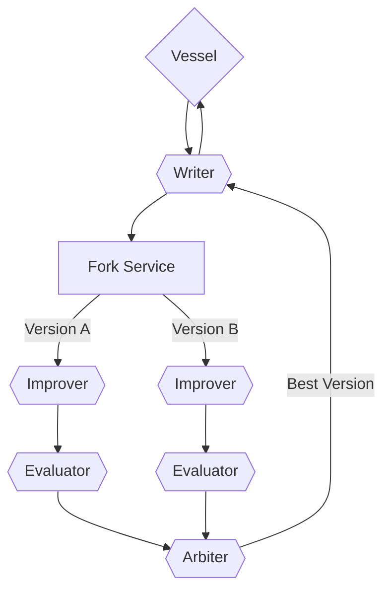

# Part II: The Protocol

---

_Imagine we’re building a new world on the internet, one where everyone is free to create. To do that, we can't use the old systems where a single company is in charge. That would be like putting wooden wagon wheels on a race car — it just won’t work. To build something truly free, we need a totally new foundation, designed from the ground up. This isn't a website or an app; it's a set of rules, like the rules for a game that anyone can play._

---

### (Chapter 4) The Plan for a Free Network

**An Operating System for Ideas**

We're not building another giant website to keep you scrolling. We're creating an *operating system for ideas*. Think of it like Windows or macOS, but instead of running apps, it helps you grow and connect your thoughts.

The goal isn't to make one huge program for everyone. It's to create rich, healthy soil where anyone can plant their own “living ideas.” Other people can then build their own tools to work with these ideas. Someone might build a simple library to store ideas, while someone else might create a powerful tool to help ideas grow. The system gets better because of all these different tools, not because one person has all the control.

This system is designed to grow. **Ideas** (which are like living documents you can share and build on) aren't all the same. They can be different types, like `Records` (memories), `Processes` (plans), or `Agents` (helpers). It's like a LEGO set: you have regular bricks, but you also have special pieces like wheels, windows, and little figures. We give you a basic set of these idea types to start with, but anyone can invent their own new types of LEGO bricks.

Your tools don't need to understand every type of idea in the world. A simple program could just handle `Records`, while a more advanced one could manage complex `Processes`. This lets the whole system grow and change, encouraging everyone to invent new things.

>Sidenote: An Ideator on a private server is like a magic box. It can take your Idea (the input data), process it, and give you a result (the output data). But how exactly it does that—its "inner world" and logic—remains a complete secret. From the outside, no one will ever know what's happening inside.

```mermaid
flowchart TB
        InputIdea[/Incoming Idea/]
        OutputIdea[\Outgoing Idea\]

    subgraph Ideator ["<div style=\"width:260px; height:8em; display:flex; justify-content: flex-start; align-items:flex-start;\">Hosted Ideator</div>"]
        direction LR
        IdeatorService{{Ideator Service}}
        HiddenContext["Private Context / Logic"]
        IdeatorService -- Calls --> HiddenContext
    end

    InputIdea -- "Sends data" --> IdeatorService
    HiddenContext -- "Returns result" --> OutputIdea

    style HiddenContext fill:#ffe,stroke:#333,stroke-width:2px,stroke-dasharray: 5 5
```

This system frees people from having to control everything. The responsibility is shared by everyone who uses it. The point isn't to manage a single website, but to give people a set of rules that lets them be truly free.

---

### (Chapter 5) How a Living Network Works

The whole system is built on one simple but powerful rule: **the idea itself explains how it works.** There are no secret commands or hidden servers. The entire network is made of just one thing: the **Idea**.

Every Idea is like a self-contained kit with three parts: the **content** (the actual thought), the **rules** (an explanation of what the content is and how to use it), and the **history** (a record of where it came from). These kits are everything—they are the messages, the instructions, and the results. Because there are no hidden parts, you can never be trapped in one system. You can always pick up all of your ideas and move them anywhere.

>Sidenote: [Act 101: Concept/Idea](../rfc/101_concept_idea.md)

Let's figure out what an "Idea" or "Concept" is in this system. It's the very first and most important building block of everything.

Imagine you're building a complicated LEGO model. You have an instruction manual, right? By itself, the manual is just a booklet with pictures, not a finished model. But it has everything you need: a list of parts and a step-by-step plan for building. You can't build it without the manual.

Here, an "Idea" is exactly like that digital instruction manual. It's a file that describes some kind of plan: a new program, a story for an AI to write, or even a plan for a science experiment. In this file, all the "parts" and "steps" are written down according to strict rules.

Why make it so complicated? So that everyone—both people and artificial intelligence—can have a common language. When all ideas are written in the same format, it's easy to pass them to each other, improve them, and work together on something big and cool. It's like a universal blueprint that any engineer in any country can understand. This document is what sets the rules for creating these "blueprints."

- **You Can't Change the Past:** The only thing you can do is share a new Idea. Ideas are permanent; you can't edit or delete them. To build on a thought, you create a *new* Idea that links back to the old one. This creates a perfect, unbroken history of how a thought grew over time. It’s like writing in a notebook—you can’t erase what’s already there, you can only add to it on the next page.

- **A Family Tree of Ideas:** Every Idea keeps track of its own history through **links**, creating a web where you can trace any thought back to its beginning. This isn't just for looking at the past; it's for working together. When a “parent” Idea gets an update (meaning a new version is created), all the “child” Ideas linked to it get a notification. This lets the owner of the “child” decide if they want to accept the new changes. This way, the entire network of ideas can grow together.

- **The Universal Translator:** The three-part structure makes every Idea easy to understand. Since each Idea carries its own rules and history, any program can work with it. The “Hello, World!” (the simplest possible program) for this system is just five lines of code: a small program that takes an Idea, shows it to an Artificial Intelligence (AI), and shares the AI’s response. This tiny program can instantly understand and use *any* Idea on the network, even types that haven't been invented yet. The AI acts like a universal translator, making it easy for anyone to join in and share knowledge.

  >Sidenote: [Act 104: Concept/Latent](../rfc/104_concept_latent_.md)

The Artificial Intelligence (LLM) is the main way to interact with things. It’s like a universal magic function that can understand any `Idea` without needing special code. It's a magic black box that turns any incoming `Idea` into a meaningful outgoing `Idea`.

```mermaid
graph TB
    Input[/Incoming Idea/] --> LLM{ shape: cloud, label: "Latent Space" }
    LLM --> Output[\Outgoing Idea\]
```

- **Create Anything, No Permission Needed:** This design lets anyone be creative without asking for permission. You can invent a new type of Idea and start sharing it right away, and it instantly becomes part of the game for the whole network. You don’t have to ask anyone to support your new invention. Because every Idea explains itself, even the simplest program with a “Universal Translator” can immediatey understand and use it. One person can release a new idea, and the entire network can adapt to it instantly.

---

### (Chapter 6) The Method — Building Big Things from Small Pieces

This system works like a building set, where you create amazing things by putting simple pieces together. The core principle is that **an Idea is not just information, but a ready-to-use 'kit' for a computer.** It packs the information itself (the **solution**) together with instructions on how to use it (the **rules** and **history**). This makes every Idea its own little world of meaning, ready to be built upon.

>Sidenote: # Act 103: Concept/Ideator

Imagine if every one of your ideas—whether it's a new game world, a story for a comic book, or a plan to build a treehouse—could have its own special "passport." This document explains just that kind of passport for ideas, which we call an **Ideator**.

An Ideator is like the DNA for an idea. It's a small text file that contains all the most important information about it. Thanks to this file, computers and programs can "understand" your idea, share it with others, and even help bring it to life.

## What is an Ideator made of?

An Ideator is just text, organized according to certain rules. It has a few main fields, just like a form:

- **`id` (Unique Number):** This is like the serial number on a passport, but for an idea. No two are the same! This is so your idea never gets mixed up with another one.
- **`name` (Name):** A simple and clear name for your idea. For example, "Corgi Lovers Club."
- **`description` (Description):** A short summary of what the idea is all about. What is it and what is it for?
- **`source` (Source):** A link to the "master plan" of the idea. This could be a link to a document with a detailed description, to the code for a program, or to a folder of drawings.
- **`meta` (Extras):** Here you can write the author's name, tags for searching (like #games, #dogs), or the date it was created.

### Example of an Ideator

Here's what the passport for an idea about a corgi lovers club might look like:

```json
{
  // A unique number so no one gets confused
  "id": "urn:uuid:123e4567-e89b-12d3-a456-426614174000",

  // The rules this passport is built on
  "schema": "https://ideator.dev/schema/v1",

  // The name of our idea
  "name": "Corgi Lovers Club",

  // A short description for everyone
  "description": "A place where everyone who loves corgis can chat, share photos, and organize meetups.",

  // Where the main document with the club rules is located
  "source": {
    "type": "http",
    "url": "https://example.com/corgi-club-manifesto.md"
  },

  // A little extra information
  "meta": {
    "author": "Anya",
    "tags": ["dogs", "community", "corgis"]
  }
}
```

## Why is all this necessary?

When every idea has a passport that's easy for machines to understand, cool things happen:

1.  **Every idea gets its own website.** A special program can read the Ideator and instantly create a simple webpage for it. And you don't need to be a programmer to do it!
2.  **Ideas are easy to find.** You can make a search engine for ideas, just like Google or YouTube. Just type in "space games" and you'll find all the ideas like that.
3.  **No one will forget the author.** If someone takes your idea and improves it, their new "passport" will always have a link to your original idea. It's like the credits in a movie—everyone knows who helped create it.
4.  **Computers help bring ideas to life.** A helper program (an agent) can read the Ideator and help out: for example, by creating a chat room to discuss the idea or running its code if it's a program.

Basically, the Ideator is the first step toward making ideas more than just thoughts in your head. They become active, living things that you can work on and develop together with the whole world.
The devices that work with these Ideas are called **Ideators**. Think of them as standardized machines for processing these "containers." An **Ideator** takes one "container" with an `Idea` as input, works with its contents according to the instructions, and always returns a new "container" with an `Idea` as output. This simple "input-output" contract is the foundation for the entire system's stability.

>Sidenote: Thanks to its "building block" nature, the protocol lets you assemble complex processes from simple, reusable blocks called Ideators, just like with LEGO. This diagram shows one of the most common ways ideas are developed: it gets copied, several teams work on improving and rating their versions in parallel, and then a main judge (`Arbiter`) chooses the best one to start a new round of improvements.



It's this “kit” model that lets us build amazing things from simple parts. Since every **Ideator** (or idea machine) speaks the same language of “kits with an `Idea` inside,” you can connect them together in long chains. The system automatically handles how they connect, letting you create powerful workflows without getting lost in the details.

Imagine an assembly line of these **Ideators**: a starting `Idea` is sent to a **Simulator** machine to imagine what it could become, then to a **Critic** machine who gives feedback, then to an **Improver** machine that makes it better, and finally to a **Publisher** machine that shares it with the world. Each machine is a simple, separate tool, but together they form a powerful system for creating new things.

This is how an idea becomes a **digital lifeform**: it survives and grows by convincing other machines to give it a little bit of their time. It travels across the network, being changed, mixed, and improved at every stop. An idea proves its worth by being able to continue this journey.