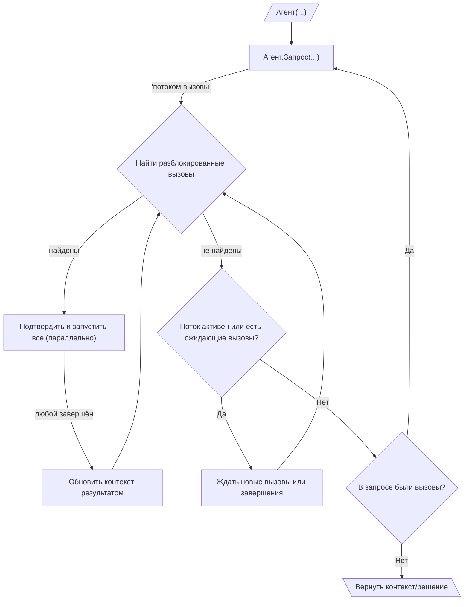

# 005: Агент/Цикл

> [!DEFINITION] :term[Цикл]{canonical="Loop"}
> Это как цепочка заданий для достижения большой цели. Агент делает один :term[Запрос]{canonical="Request"}, получает в ответ команду (или :term[Вызов]{canonical="Call"}), выполняет её, а результат использует для следующего :term[Запроса]{canonical="Request"}. Он повторяет это снова и снова, пока не выполнит всю задачу и не останется никаких команд.


> Sidenote:
> - Требуется понимание:
>   - :term[001: Агент/Запрос]{href="./001_agent_request.md"}
>   - :term[002: Агент/Инструмент]{href="./002_agent_tool.md"}
>   - :term[004: Агент/Вызов]{href="./004_agent_call.md"}

Этот документ рассказывает о :term[Цикле исполнения]{canonical="Execution Loop"} — это как бы «двигатель», который позволяет агенту решать сложные задачи, состоящие из многих шагов. Он делает это, многократно отправляя :term[Запросы]{canonical="Request"}. Именно этот повторяющийся процесс — собрать информацию, использовать инструмент, получить результат и учесть его — и есть то, что мы называем «агентом».

## Цикл исполнения

Цикл исполнения — это главный способ, которым агент самостоятельно выполняет задачи в несколько этапов. Работает он как матрёшка, где один цикл вложен в другой:

::::columns
:::column

1.  **Внешний цикл (Создание запросов):** Жизнь агента — это последовательность :term[Запросов]{canonical="Request"}. Он начинает с какой-то начальной информацией и входит в цикл.
2.  **Потоковая передача запросов и вызовов:** Внутри цикла он создаёт один :term[Запрос]{canonical="Request"}. Этот :term[Запрос]{canonical="Request"} сразу же, по мере готовности, начинает отправлять :term[Вызовы]{canonical="Call"} (команды), которые собираются в очередь ожидания.
3.  **Внутренний цикл (Управление вызовами):** Для каждого :term[Запроса]{canonical="Request"} запускается внутренний цикл, который отвечает за выполнение всех его :term[Вызовов]{canonical="Call"}. Этот процесс очень быстрый и может идти параллельно:
    - Управляющий постоянно проверяет очередь ожидающих :term[Вызовов]{canonical="Call"}, чтобы найти те, которые уже можно выполнить (то есть все их зависимости удовлетворены).
    - Все разблокированные :term[Вызовы]{canonical="Call"} можно показать человеку для подтверждения, а затем запустить на выполнение одновременно. Это возможно, потому что :term[Состояние]{canonical="State"} агента сделано неизменяемым; каждый :term[Вызов]{canonical="Call"} записывает результат в своё уникальное место (`_outputPath`), что исключает путаницу.
    - Как только :term[Вызов]{canonical="Call"} завершается, его результат обновляет общую информацию, что может разблокировать другие ожидающие :term[Вызовы]{canonical="Call"}.
    - Этот умный параллельный процесс продолжается, пока не поступят все :term[Вызовы]{canonical="Call"} от текущего :term[Запроса]{canonical="Request"} и очередь не опустеет. Такая модель сильно ускоряет работу, ведь агент может начать выполнять несколько независимых шагов одновременно, даже не зная всего плана наперёд.
4.  **Проверка завершения:** Когда внутренний цикл заканчивается, агент смотрит на итоговое :term[Решение]{canonical="Solution"} от родительского :term[Запроса]{canonical="Request"}. Если в нём нет новых :term[Вызовов]{canonical="Call"}, считается, что цель достигнута, и внешний цикл останавливается.
5.  **Продолжение:** Если в :term[Решении]{canonical="Solution"} были :term[Вызовы]{canonical="Call"}, агент возвращается к шагу 2 и создаёт новый :term[Запрос]{canonical="Request"}, но уже с обновлённой информацией, включающей результаты предыдущего шага.
6.  **Вывод результата:** После остановки в поле `output` финального :term[Решения]{canonical="Solution"} будет содержаться ответ, соответствующий тому формату, который задал пользователь.

:::
:::column



:::
::::

## :term[Человек-в-цикле]{canonical="HITL (Human-in-the-Loop)"} (:term[HITL]{canonical="HITL (Human-in-the-Loop)"})

Новый :term[Цикл исполнения]{canonical="Execution Loop"} отлично поддерживает контроль со стороны человека, так как шаг подтверждения находится прямо перед выполнением. Это гарантирует, что человеку предлагают одобрить только те действия, которые действительно готовы к запуску:

- **Одобрение:** Перед тем как выполнить разблокированный :term[Вызов]{canonical="Call"}, система может показать его пользователю для одобрения. Это очень эффективно, потому что человеку не нужно тратить время на проверку команд, которые могут быть заблокированы и никогда не запустятся.
- **Исправление:** Пользователь может изменить параметры :term[Вызова]{canonical="Call"} или даже заменить его на другой.

Важно отметить, что эти конкретные способы участия человека не являются частью основного протокола. Архитектура просто разделяет «предложение» и «выполнение» действий. Это даёт разработчикам свободу создавать любые виды вмешательства: от простого ручного одобрения до сложных автоматических систем с таймерами.

Эта возможность очень важна для безопасности и для совместных задач, где агент выступает в роли помощника. Корректировки и отзывы пользователя могут быть учтены в :term[Плане]{canonical="Plan"}, позволяя агенту улучшать свою стратегию на основе человеческого вклада.

## Роль данных в цикле

:term[Цикл исполнения]{canonical="Execution Loop"} создаёт динамическую структуру для поведения агента, но его настоящая сила — в данных, которые циркулируют внутри него. За это отвечает тип сообщения :term[Данные]{canonical="Data"}, который мы рассмотрим в :term[006: Агент/Данные]{href="./006_agent_data.md"}.

```

```
