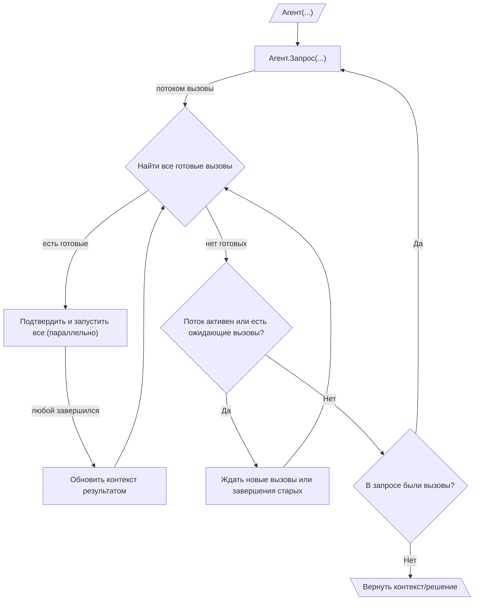

# 010: Агент/Цикл

> [!DEFINITION] [Цикл](./000_glossary.md)
> Это цепочка :term[Запросов]{canonical="Request"}, которые помогают достичь какой-то цели. Агент делает один :term[Запрос]{canonical="Request"} за другим, обрабатывает полученные :term[Вызовы]{canonical="Call"} и использует результат для следующего :term[Запроса]{canonical="Request"}. Так продолжается до тех пор, пока :term[Вызовы]{canonical="Call"} не закончатся.

> Sidenote:
> - Требуется:
>   - :term[001: Агент/Запрос]{href="./001_agent_request.md"}
>   - :term[008: Агент/Вывод]{href="./008_agent_output.md"}

:term[Цикл исполнения]{canonical="Execution Loop"} — это как мотор, который заставляет работать все типы сообщений и правила, о которых мы говорили раньше. Он позволяет агенту выполнять сложные задачи из нескольких шагов, раз за разом отправляя :term[Запросы]{canonical="Request"}. Этот процесс, когда агент собирает информацию, использует инструменты и получает обратную связь, и есть то, что мы обычно называем «агентом».

## Цикл исполнения

Цикл исполнения — это главный способ для агента самостоятельно выполнять многошаговые задачи. Он работает как два цикла, один внутри другого:

::::columns
:::column

1.  **Внешний цикл (Создание запросов):** Жизнь агента — это последовательность :term[Запросов]{canonical="Request"}. Он начинает с какой-то начальной информации и входит в цикл.
2.  **Потоковая передача Запроса и Вызовов:** Внутри цикла агент отправляет один :term[Запрос]{canonical="Request"}. Этот :term[Запрос]{canonical="Request"} по мере выполнения присылает :term[Вызовы]{canonical="Call"} обратно один за другим. Все они собираются в очередь ожидания.
3.  **Внутренний цикл (Управление Вызовами):** Для каждого :term[Запроса]{canonical="Request"} есть внутренний цикл, который отвечает за выполнение всех его :term[Вызовов]{canonical="Call"}. Этот процесс очень быстрый и параллельный:
    - Управляющий постоянно проверяет очередь ожидающих :term[Вызовов]{canonical="Call"}, чтобы найти те, которые уже можно выполнить (то есть все их зависимости выполнены).
    - Все готовые :term[Вызовы]{canonical="Call"} можно показать человеку для подтверждения, а затем запустить одновременно. Это безопасно, потому что :term[Состояние]{canonical="State"} агента неизменно: как только что-то записано по определённому пути через :term[Путь вывода]{canonical="Output Path"}, это уже нельзя перезаписать. Это позволяет модели предлагать взаимоисключающие :term[Вызовы]{canonical="Call"} (например, разные ветки условия), которые пишут результат в одно и то же место. Тот вызов, который выполнится первым, запишет значение, а другие, альтернативные, уже не запустятся, потому что их условие (путь должен быть пустым) больше не выполняется. Это гарантирует, что результат будет всегда одинаковым и без конфликтов.

      > Sidenote:
      > - [008: Агент/Вывод](./008_agent_output.md)

    - Когда :term[Вызов]{canonical="Call"} завершается, его результат обновляет общую информацию, что может разблокировать другие ожидающие :term[Вызовы]{canonical="Call"}.
    - Такой быстрый параллельный процесс продолжается до тех пор, пока поток для текущего :term[Запроса]{canonical="Request"} не закроется и все его ожидающие :term[Вызовы]{canonical="Call"} не будут выполнены. Это сильно сокращает время ожидания, потому что агент может начать работать над несколькими независимыми шагами одновременно, даже не зная всего плана целиком.

4.  **Проверка завершения:** Когда внутренний цикл заканчивается, агент смотрит на итоговое :term[Решение]{canonical="Solution"} родительского :term[Запроса]{canonical="Request"}. Если в нём нет :term[Вызовов]{canonical="Call"}, значит, цель агента достигнута, и внешний цикл останавливается.
5.  **Продолжение:** Если в :term[Решении]{canonical="Solution"} были :term[Вызовы]{canonical="Call"}, агент возвращается к шагу 2 и отправляет новый :term[Запрос]{canonical="Request"}, но уже с дополненной информацией, которая содержит результаты предыдущего шага.
6.  **Получение результата:** После остановки в поле `output` итогового :term[Решения]{canonical="Solution"} будет находиться результат, который соответствует формату, заданному пользователем.

:::
:::column

:::
::::

## :term[Человек в цикле]{canonical="HITL"}

Новый :term[Цикл исполнения]{canonical="Execution Loop"} отлично поддерживает контроль со стороны человека, так как шаг подтверждения находится прямо перед выполнением. Это гарантирует, что пользователя попросят одобрить только те вызовы, которые уже готовы к запуску:

- **Одобрение:** Перед тем как выполнить готовый :term[Вызов]{canonical="Call"}, система может показать его пользователю для одобрения. Это очень удобно, ведь пользователю не приходится проверять и подтверждать вызовы, которые могут быть заблокированы и никогда не запустятся.
- **Исправление:** Пользователь может изменить параметры :term[Вызова]{canonical="Call"} или даже заменить его на другой.

Важно понимать, что эти конкретные способы участия человека (:term[HITL]{canonical="HITL (Human-in-the-Loop)"}) не являются частью основного протокола. Архитектура просто разделяет процесс предложения действий от их выполнения. Это даёт разработчикам свободу создавать любые виды вмешательства: от простого ручного одобрения до сложной автоматической системы с таймерами.

Эта возможность очень важна для безопасности и для совместных задач, где агент выступает в роли помощника. Корректировки и отзывы пользователя могут быть использованы в :term[Плане]{canonical="Plan"}, позволяя агенту улучшать свою стратегию на основе человеческого ввода.

## От простых циклов к стратегическим планам

:term[Цикл исполнения]{canonical="Execution Loop"} создаёт основу для поведения агента, но его главная сила — в выполнении быстрых, одноразовых :term[Запросов]{canonical="Request"}. Чтобы управлять сложными задачами из множества шагов с зависимостями, нужна более продвинутая система стратегического планирования.

В следующем документе, :term[011: Агент/План]{href="./011_agent_plan.md"}, мы познакомимся с протоколом, который позволяет описывать такие долгосрочные стратегии в виде графа взаимосвязанных :term[Вызовов инструментов]{canonical="Call"}.
