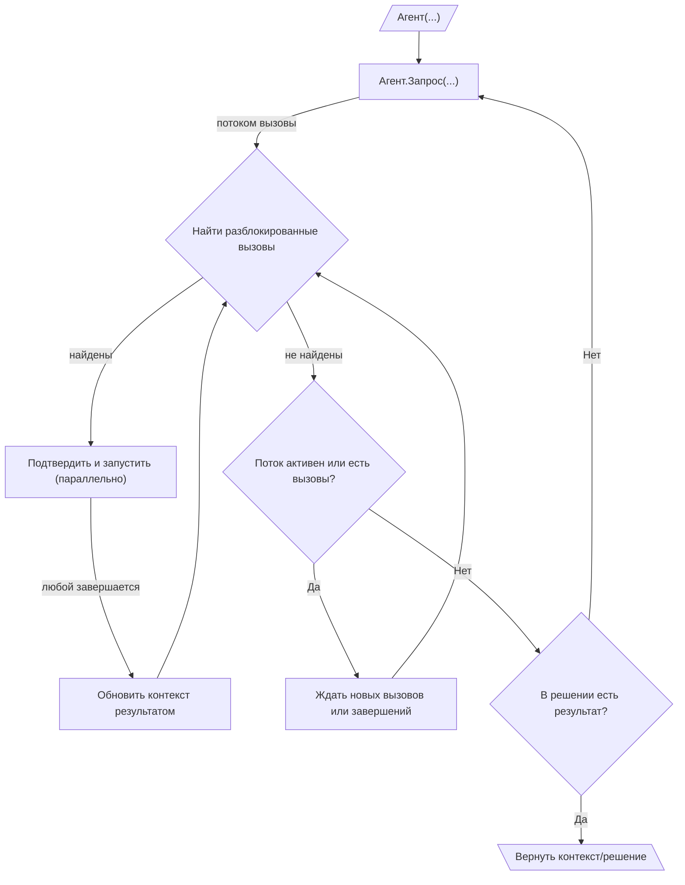

# 010: Агент/Цикл

> [!DEFINITION] [Цикл](./000_glossary.md)
> Это повторяющаяся последовательность :term[запросов]{canonical="Request"}, направленная на достижение цели. Агент продолжает отправлять :term[запросы]{canonical="Request"}, обрабатывать полученные в ответ :term[вызовы]{canonical="Call"} и добавлять результат обратно в свою «память» (контекст), пока нейросеть не сгенерирует :term[финальный результат]{canonical="Final Output"}, сигнализируя о завершении задачи.

> Sidenote:
> - Требуется:
>   - :term[001: Агент/Запрос]{href="./001_agent_request.md"}
>   - :term[008: Агент/Вывод]{href="./008_agent_output.md"}

:term[Цикл исполнения]{canonical="Execution Loop"} — это как двигатель, который приводит в движение все типы сообщений и правил из предыдущих глав. Он позволяет агенту выполнять задачи из нескольких шагов, раз за разом делая :term[запросы]{canonical="Request"}. Именно этот повторяющийся процесс сборки информации, использования инструментов и получения ответа обычно и называют «агентом».

## Цикл исполнения

Цикл исполнения — это главный механизм, с помощью которого агент действует самостоятельно и выполняет многошаговые задачи. Он работает как матрёшка, где один цикл находится внутри другого:

::::columns
:::column

1.  **Внешний цикл (Создание запросов):** Жизненный цикл агента — это последовательность :term[запросов]{canonical="Request"}. Он начинается с какой-то первоначальной информацией и входит в цикл.
2.  **Потоковая передача запросов и вызовов:** Находясь в цикле, агент отправляет один :term[запрос]{canonical="Request"}. В ответ на этот :term[запрос]{canonical="Request"} к нему постепенно, как видео на YouTube, начинают поступать :term[вызовы]{canonical="Call"}. Все они собираются в очередь ожидания.
3.  **Внутренний цикл (Управление вызовами):** Для каждого :term[запроса]{canonical="Request"} запускается свой внутренний цикл, который отвечает за выполнение всех связанных с ним :term[вызовов]{canonical="Call"}. Этот процесс похож на работу диспетчера, который реагирует на два события: когда от нейросети приходит новый :term[вызов]{canonical="Call"} или когда уже работающий :term[вызов]{canonical="Call"} завершается. Всё происходит очень быстро и одновременно:
    - «Диспетчер» постоянно проверяет очередь ожидающих :term[вызовов]{canonical="Call"}, чтобы найти те, которые уже можно выполнить (то есть все их зависимости удовлетворены).
    - Все «разблокированные» :term[вызовы]{canonical="Call"} можно показать человеку для подтверждения, а затем запустить на выполнение параллельно. Это позволяет всё делать очень быстро, но требует аккуратного управления данными. Если несколько одновременных :term[вызовов]{canonical="Call"} пытаются записать что-то в одно и то же место в :term[состоянии]{canonical="State"} агента, итоговое значение будет тем, которое записалось последним. Система решает такие конфликты по принципу «кто последний, тот и прав».

      > Sidenote:
      > - [008: Агент/Вывод](./008_agent_output.md)

    - Как только какой-либо :term[вызов]{canonical="Call"} завершается, его результат обновляет общую «память» агента, что может «разблокировать» другие ожидающие :term[вызовы]{canonical="Call"}.
    - Такое параллельное выполнение продолжается до тех пор, пока поток данных для текущего :term[запроса]{canonical="Request"} не закроется и все его ожидающие :term[вызовы]{canonical="Call"} не будут выполнены. Эта модель сильно сокращает время ожидания, потому что агент может начать работать над несколькими независимыми шагами одновременно, даже не зная всего плана наперёд.

4.  **Завершение и продолжение:** Как только внутренний цикл для одного :term[запроса]{canonical="Request"} завершён, агент проверяет итоговое :term[решение]{canonical="Solution"}. Он решает, продолжать работу или нет, по полю `output`:
    - **Если `output` равен `null`**, агент понимает, что задача ещё не решена. Он возвращается к шагу 2 и отправляет новый :term[запрос]{canonical="Request"}, но уже с обновлённой «памятью», в которой теперь есть результаты только что выполненных :term[вызовов]{canonical="Call"}.
    - **Если `output` не равен `null`**, цель агента считается достигнутой. Внешний цикл останавливается, и значение `output`, которое соответствует заданному пользователем формату, возвращается как финальный результат. Агент может за один шаг создать и `calls` (вызовы), и финальный `output` (результат); именно наличие `output` является сигналом к остановке.

:::
:::column

:::
::::

## :term[Человек-в-контуре]{canonical="HITL"}

Новый :term[цикл исполнения]{canonical="Execution Loop"} очень удобен для контроля со стороны человека, потому что шаг подтверждения находится прямо перед выполнением. Это означает, что человеку предлагают одобрить только те действия, которые действительно готовы к запуску:

- **Одобрение:** Перед тем, как «разблокированный» :term[вызов]{canonical="Call"} будет выполнен, система может показать его человеку для одобрения. Это очень эффективно, так как человеку не приходится просматривать и подтверждать вызовы, которые могут быть заблокированы зависимостями и никогда не запустятся.
- **Исправление:** Человек может изменить параметры :term[вызова]{canonical="Call"} или даже заменить его на другой.

Важно отметить, что эти конкретные механизмы :term[ЧВК]{canonical="HITL (Human-in-the-Loop)"} (контроля со стороны человека) не являются частью основного протокола. Архитектура просто обеспечивает необходимое разделение между предложением действий и их выполнением, давая разработчикам свободу реализовывать любые виды вмешательства: от простого ручного одобрения до сложных автоматизированных систем с таймерами.

Эта возможность критически важна для безопасности и для совместных задач, где агент выступает в роли помощника. Корректировки и обратная связь от пользователя могут быть использованы в :term[плане]{canonical="Plan"}, позволяя агенту совершенствовать свою стратегию на основе человеческого вклада.

## От простых циклов к стратегическим планам

:term[Цикл исполнения]{canonical="Execution Loop"} создаёт динамичную структуру для поведения агента, но его главная сила — в выполнении тактических, одноразовых :term[запросов]{canonical="Request"}. Для управления сложными, многошаговыми процессами с зависимостями требуется более продвинутая система стратегического планирования.

Следующий документ, :term[011: Агент/Выражения]{href="./011_agent_expressions.md"}, знакомит с протоколом для определения этих долгосрочных стратегий в виде графа взаимосвязанных :term[вызовов инструментов]{canonical="Call"}.
