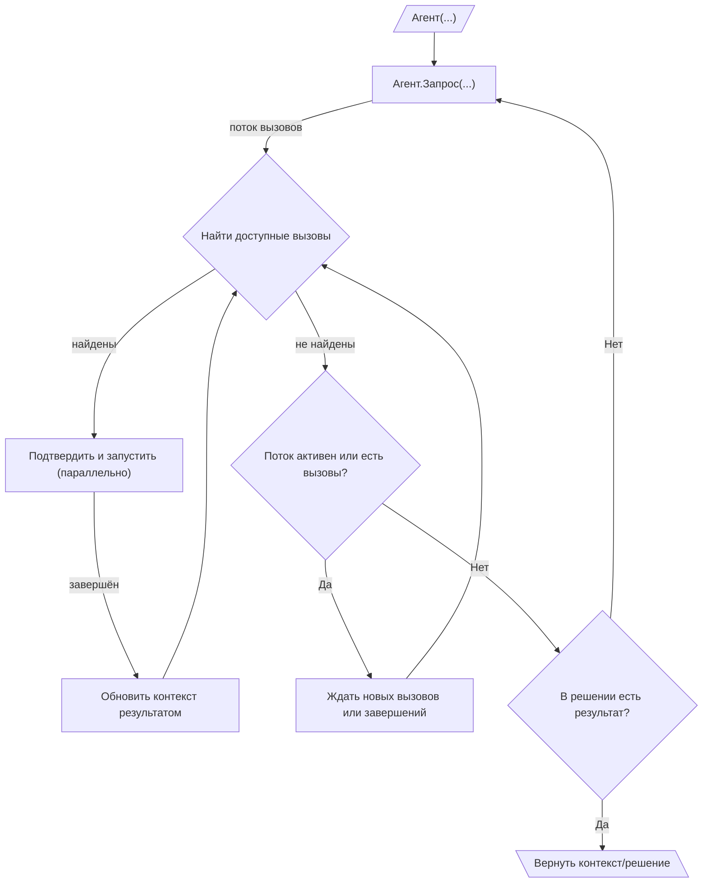

# 010: Агент/Цикл

> [!DEFINITION] [Цикл](./000_glossary.md)
> Это как будто робот пытается решить задачку, пробуя разные действия одно за другим. Он делает :term[запрос]{canonical="Request"}, получает список команд (:term[вызовов]{canonical="Call"}), выполняет их, а результат использует для следующего шага. Так он продолжает, пока не получит :term[финальный ответ]{canonical="Final Output"}, который означает: «Задачка решена!».

> Sidenote:
> - Требуются:
>   - :term[001: Агент/Запрос]{href="./001_agent_request.md"}
>   - :term[008: Агент/Вывод]{href="./008_agent_output.md"}

Представьте :term[Цикл Исполнения]{canonical="Execution Loop"} как моторчик, который заставляет работать все части агента, о которых мы говорили раньше. Благодаря этому моторчику агент может выполнять сложные задачи, состоящие из многих шагов, раз за разом отправляя :term[запросы]{canonical="Request"}. Именно этот процесс — сборка информации, использование инструментов и получение обратной связи — и делает «агента» по-настоящему умным помощником.

## Цикл Исполнения

Цикл исполнения — это главный механизм, который позволяет агенту действовать самостоятельно и шаг за шагом. Он работает как матрёшка, где один цикл вложен в другой:

::::columns
:::column

1.  **Внешний цикл (Создание Запросов):** Жизнь агента — это последовательность :term[запросов]{canonical="Request"}. Он начинает с какой-то начальной информацией и входит в этот большой цикл.
2.  **Потоковая передача Запросов и Вызовов:** Внутри цикла агент делает один :term[запрос]{canonical="Request"}. В ответ ему начинают приходить :term[вызовы]{canonical="Call"} (команды), как сообщения в чате. Все они собираются в очередь ожидания.
3.  **Внутренний цикл (Выполнение Команд):** Для каждого :term[запроса]{canonical="Request"} запускается свой маленький цикл, который отвечает за выполнение команд. Этот процесс похож на диспетчера на кухне. Он запускается, когда происходит одно из двух: либо приходит новая команда от «мозга» (ИИ), либо завершается выполнение старой. Всё происходит очень быстро и одновременно:
    - Диспетчер постоянно смотрит на очередь команд и выбирает все, которые можно выполнить прямо сейчас (то есть все нужные для них данные уже готовы).
    - Все готовые к выполнению :term[вызовы]{canonical="Call"} можно показать человеку для подтверждения, а затем запустить параллельно. Это очень ускоряет работу, но требует аккуратности. Если несколько команд одновременно пытаются записать что-то в одно и то же место в :term[памяти]{canonical="State"} агента, то сохранится результат той, которая завершилась последней. Это может привести к непредсказуемым результатам, поэтому система просто использует правило «кто последний, тот и прав».

    - Когда команда выполнена, её результат обновляет общую «картину мира» агента, что может разблокировать другие команды в очереди.
    - Такое параллельное выполнение команд продолжается до тех пор, пока поток команд для текущего :term[запроса]{canonical="Request"} не закончится и вся очередь не опустеет. Эта модель сильно сокращает время ожидания, так как агент может начать работать над несколькими независимыми задачами одновременно, даже не зная всего плана наперёд.

4.  **Завершение или Продолжение:** Когда внутренний цикл для одного :term[запроса]{canonical="Request"} завершён, агент смотрит на итоговое :term[решение]{canonical="Solution"}. Чтобы понять, продолжать работу или нет, он проверяет поле `output` (результат):
    - **Если `output` — `null` (пусто)**, агент считает, что задача ещё не выполнена. Он возвращается к шагу 2 и делает новый :term[запрос]{canonical="Request"}, но уже с обновлённой информацией, включающей результаты выполненных команд.
    - **Если `output` не пустой**, цель агента считается достигнутой. Внешний цикл останавливается, и значение `output` возвращается как финальный результат. Агент может в одном шаге и выполнить команды, и выдать финальный результат; именно наличие `output` служит сигналом к остановке.

      > Sidenote:
      > - [008: Агент/Вывод](./008_agent_output.md)

:::
:::column

:::
::::

## :term[Человек-в-цикле]{canonical="HITL"}

Новый :term[Цикл Исполнения]{canonical="Execution Loop"} отлично подходит для контроля со стороны человека, потому что шаг подтверждения находится прямо перед выполнением. Это гарантирует, что человеку предлагают проверить только те действия, которые уже готовы к запуску:

- **Одобрение:** Перед тем как выполнить готовую команду (:term[вызов]{canonical="Call"}), система может показать её человеку для одобрения. Это эффективно, потому что человеку не нужно просматривать и подтверждать команды, которые могут быть заблокированы и никогда не запустятся.
- **Исправление:** Человек может изменить параметры :term[вызова]{canonical="Call"} или даже заменить его на другой.

Важно понимать, что эти конкретные способы участия человека (:term[HITL]{canonical="HITL (Human-in-the-Loop)"}) не являются частью основного протокола. Архитектура просто разделяет «предложение» действия и его «выполнение», давая разработчикам возможность встроить любой вид вмешательства: от простого ручного одобрения до сложной автоматической системы с таймерами.

Эта возможность очень важна для безопасности и для совместной работы, где агент выступает в роли помощника. Корректировки и отзывы человека могут быть учтены в :term[плане]{canonical="Plan"}, позволяя агенту улучшать свою стратегию на основе человеческого вклада.

## Обработка ошибок и самоисправление

Цикл Исполнения спроектирован так, чтобы быть устойчивым к сбоям. Он создаёт «сеть безопасности», которая позволяет агенту справляться как с собственными ошибками в планировании, так и с неожиданными сбоями во время работы. Это достигается за счёт того, что ошибки не игнорируются, а превращаются в полезную информацию и отправляются обратно в «мозг» (ИИ).

### Сообщение об ошибке

Для этого система использует специальное **`Сообщение об ошибке`**, основанное на `Сообщении с данными`. Когда происходит ошибка, цикл создаёт такое сообщение и добавляет его в контекст для следующего шага. В его свойстве `data` содержатся две важные вещи:

- **`call`**: полная информация о команде, которая не сработала.
- **`error`**: объект или текст, объясняющий причину сбоя.

### Цикл самоисправления

Цикл отлавливает два основных типа сбоев:

1.  **Структурные ошибки**: обнаруживаются _до_ выполнения. Например, если параметры команды не соответствуют правилам, перепутаны типы данных или есть неверные :term[ссылки на переменные]{canonical="Variable Reference"}.
2.  **Ошибки выполнения**: обнаруживаются _во время_ выполнения. Это происходит, когда какое-то :term[действие]{canonical="Activity"} вызывает непредвиденную ошибку (например, сбой в API или внутренняя ошибка в коде).

Когда происходит любая из этих ошибок, цикл создаёт `Сообщение об ошибке` и добавляет его во временный список. В конце рабочего такта (когда больше нет готовых к запуску команд), все собранные `Сообщения об ошибках` добавляются в общий контекст.

Это даёт ИИ прямую и понятную обратную связь. На следующем шаге он видит, какая команда не сработала и почему, что позволяет ему «отладить» ситуацию и предложить исправленный план.

> [!HEADSUP] Проактивная и реактивная обработка ошибок
> 
> Способность цикла ловить ошибки и сообщать о них ИИ — это **реактивная** мера безопасности для непредвиденных сбоев. Однако самые надёжные системы заранее готовятся к возможным неудачам.
> 
> Используя систему :term[Планов]{href="./012_agent_plan.md"} с ветвлениями на основе :term[Выражений]{href="./011_agent_expressions.md"}, вы можете создать чёткие «успешный» и «неудачный» пути для ваших инструментов. :term[Действие]{canonical="Activity"} может само обрабатывать свои ошибки и, вместо того чтобы ломаться, возвращать специальное `Сообщение с данными`, которое направит работу по заранее продуманному запасному пути. Такой **проактивный** подход подробно описан в главе о Планах.

## От простых циклов к стратегическим планам

:term[Цикл Исполнения]{canonical="Execution Loop"} создаёт основу для действий агента, но его сила — в выполнении тактических, одноразовых :term[запросов]{canonical="Request"}. Для управления сложными многоэтапными задачами с зависимостями друг от друга требуется более продвинутая система стратегического планирования.

Следующий документ, :term[011: Агент/Выражения]{href="./011_agent_expressions.md"}, представит протокол для определения таких долгосрочных стратегий в виде графа взаимосвязанных :term[Вызовов Инструментов]{canonical="Call"}.
