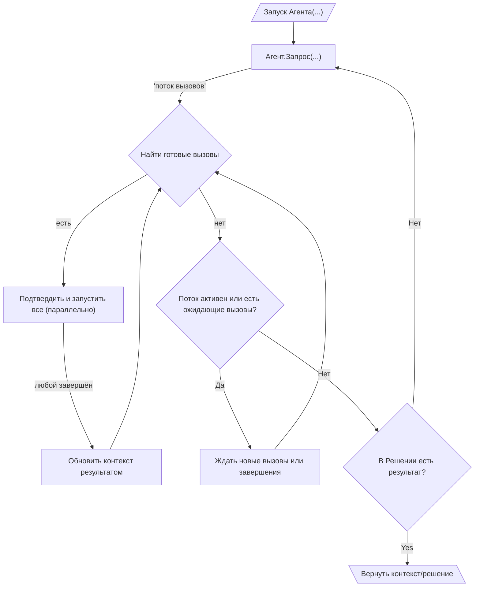

# 010: Агент/Цикл

> [!DEFINITION] [Цикл](./000_glossary.md)
> Это когда компьютерный помощник (агент) раз за разом повторяет серию шагов, чтобы достичь цели. Он делает :term[Запрос]{canonical="Request"}, получает в ответ :term[Вызовы]{canonical="Call"} (команды), выполняет их и использует результат, чтобы сделать следующий, более умный :term[Запрос]{canonical="Request"}. Так продолжается до тех пор, пока он не получит :term[Финальный Результат]{canonical="Final Output"}, который означает: «Задание выполнено!».

> Sidenote:
> - Требуются знания из:
>   - :term[001: Агент/Запрос]{href="./001_agent_request.md"}
>   - :term[008: Агент/Вывод]{href="./008_agent_output.md"}

:term[Цикл выполнения]{canonical="Execution Loop"} — это как дирижёр для оркестра. Он управляет всеми сообщениями и правилами из предыдущих глав. Именно он позволяет агенту выполнять сложные задачи из нескольких шагов, снова и снова отправляя :term[Запросы]{canonical="Request"}. Этот постоянный процесс — собрать информацию, использовать инструмент, получить результат и снова собрать информацию — и есть то, что мы обычно имеем в виду, говоря «агент».

## Цикл выполнения

Цикл выполнения — это главный способ, которым агент самостоятельно выполняет задачи из нескольких шагов. Он работает как матрёшка: один цикл находится внутри другого.

::::columns
:::column

1.  **Внешний цикл (Создание Запросов):** Жизнь агента — это череда :term[Запросов]{canonical="Request"}. Он начинает с какой-то начальной информации и входит в этот большой цикл.
2.  **Потоковая передача Запросов и Вызовов:** Внутри цикла он отправляет один :term[Запрос]{canonical="Request"}. В ответ начинают поступать :term[Вызовы]{canonical="Call"} (команды) — не все сразу, а одна за другой, как видео в интернете. Все эти команды собираются в очередь, ожидая своего часа.
3.  **Внутренний цикл (Управление Вызовами):** Это как маленький, очень быстрый менеджер внутри большого цикла. Для каждого :term[Запроса]{canonical="Request"} запускается этот внутренний цикл, который выполняет все связанные с ним :term[Вызовы]{canonical="Call"}. Он реагирует на два события: либо пришла новая команда (:term[Вызов]{canonical="Call"}), либо завершилась старая. Этот процесс очень быстрый и одновременный:
    - Менеджер постоянно проверяет очередь команд (:term[Вызовов]{canonical="Call"}) и находит все те, которые уже можно выполнить (например, для них готовы все нужные данные).
    - Все готовые к выполнению :term[Вызовы]{canonical="Call"} можно показать человеку для подтверждения, а затем запустить одновременно. Это позволяет работать очень быстро, но требует аккуратности. Если несколько команд одновременно пытаются записать что-то в одно и то же место в :term[Состоянии]{canonical="State"} агента, победит та, которая закончит последней.

    - Как только какая-либо команда (:term[Вызов]{canonical="Call"}) завершается, её результат обновляет общую информацию, что может разблокировать другие команды в очереди.
    - Такое быстрое и параллельное выполнение продолжается до тех пор, пока не перестанут приходить новые команды для текущего :term[Запроса]{canonical="Request"} и вся очередь не опустеет. Это сильно сокращает время ожидания, ведь агент может начать работать над несколькими задачами сразу, даже не зная всего плана наперёд.

4.  **Завершение и продолжение:** Когда внутренний цикл для одного :term[Запроса]{canonical="Request"} закончен, агент смотрит на итоговое :term[Решение]{canonical="Solution"} и проверяет поле `output`:
    - **Если `output` пусто (`null`)**, агент понимает, что задача ещё не решена. Он возвращается к шагу 2 и отправляет новый :term[Запрос]{canonical="Request"}, но уже с обновлённой информацией, включающей результаты выполненных команд.
    - **Если в `output` что-то есть**, цель агента считается достигнутой. Внешний цикл останавливается, и это значение `output` возвращается как финальный ответ. Агент может в одном шаге и выполнить команды (`calls`), и выдать финальный результат (`output`); именно наличие `output` — это сигнал остановиться.

      > Sidenote:
      > - [008: Агент/Вывод](./008_agent_output.md)

:::
:::column

:::
::::

## :term[Человек в цикле]{canonical="HITL"}

Новый :term[Цикл выполнения]{canonical="Execution Loop"} очень удобен для контроля со стороны человека, потому что шаг подтверждения происходит прямо перед выполнением. Это значит, что человеку предлагают проверить только те команды, которые действительно готовы к запуску:

- **Одобрение:** Перед тем как выполнить готовую команду (:term[Вызов]{canonical="Call"}), система может показать её пользователю для одобрения. Это очень эффективно, потому что человеку не нужно разбирать команды, которые всё равно не запустятся из-за каких-то зависимостей.
- **Исправление:** Пользователь может изменить параметры команды (:term[Вызова]{canonical="Call"}) или даже заменить её на другую.

Важно понимать, что эти конкретные способы контроля (:term[HITL]{canonical="HITL (Human-in-the-Loop)"}) не являются обязательной частью протокола. Система просто разделяет этапы «предложить действие» и «выполнить действие». Это даёт разработчикам свободу придумывать любые способы вмешательства: от простого ручного подтверждения до сложных автоматических проверок.

Эта возможность очень важна для безопасности и для совместной работы, где агент выступает в роли помощника. Корректировки и отзывы пользователя могут быть учтены в :term[Плане]{canonical="Plan"}, позволяя агенту улучшать свою стратегию на основе человеческого вклада.

## От простых циклов к стратегическим планам

:term[Цикл выполнения]{canonical="Execution Loop"} создаёт основу для действий агента, но лучше всего он справляется с быстрыми, одномоментными :term[Запросами]{canonical="Request"}. Чтобы управлять по-настоящему сложными задачами с множеством шагов и зависимостей, нужна более продвинутая система стратегического планирования.

Следующий документ, :term[011: Агент/Выражения]{href="./011_agent_expressions.md"}, расскажет, как описывать такие долгосрочные стратегии в виде схемы из связанных между собой :term[Вызовов инструментов]{canonical="Call"}.
