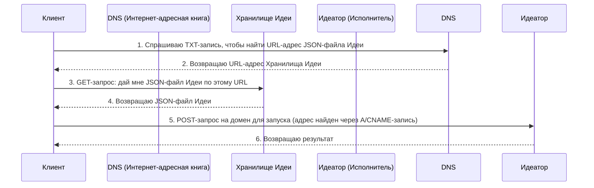

# 102: Концепция/Суверенитет

Представьте, что вы что-то создали — например, написали книгу или изобрели игру. **Суверенитет** — это ваша свобода решать, где будет храниться ваша книга, как люди будут её читать и кто сможет в неё играть. Этот документ объясняет, как мы даём создателям такую свободу в нашей системе.

## Введение

Этот документ описывает правила **Суверенитета**, которые определяют, насколько независимыми могут быть создатели в нашей экосистеме. Мы предлагаем «слоёную» систему для хранения и запуска идей. Участники могут выбирать уровень контроля: от использования наших готовых сервисов до полного размещения всего на своих собственных серверах, становясь абсолютно независимыми.

Эта модель — как мост, который соединяет абстрактную `Идею` с реальным, работающим сервисом.

## Децентрализованная личность через DNS

Представьте, что у каждой вашей идеи есть свой собственный, уникальный адрес в интернете, как у сайта. Этот адрес — её «личность». Главный принцип нашей системы в том, что вы, как создатель, полностью контролируете этот адрес. Благодаря этому ваша идея не привязана к какой-то одной компании или платформе.

Как это работает? У каждой `Идеи` есть уникальное доменное имя (адрес сайта). В настройках этого домена есть специальная текстовая заметка (`TXT`-запись), которая указывает на файл, где хранится полное описание вашей `Идеи` в формате JSON. Поскольку вы контролируете эту заметку, вы — и только вы — решаете, где находится ваша `Идея` и кто за неё отвечает.

### Единый поток запросов: Суверенитет пользователя через DNS

На схеме ниже показаны два основных действия с Идеей: получение её описания (`GET`) и её запуск как сервиса (`POST`). Схема иллюстрирует, как обычные интернет-записи (DNS) дают пользователю полный контроль над тем, куда направлять запросы.

**Ваши настройки DNS — это ваш пульт управления.** Заметка `TXT` указывает, где лежит файл с описанием `Идеи` (Хранилище Идеи). А основная запись домена (`A` или `CNAME`) указывает, где эту `Идею` нужно запускать (Идеатор). Управляя этими двумя записями, вы решаете, использовать ли наши готовые сервисы или собственные.

> [!HEADSUP] Heads up
> Думайте об этой модели как о шкале независимости. На одном конце — готовый сервис, который всё делает за вас, это очень удобно. На другом — **полный суверенитет**: вы используете свой собственный интернет-адрес и сами размещаете все нужные программы, становясь своим собственным провайдером. Наши готовые «слои» — это просто ступеньки, которые помогают вам двигаться от удобства к полной независимости, если вы того захотите.



## Слоёная архитектура

Поверх основного принципа (ваша `Идея` — это ваш уникальный адрес в сети) мы предлагаем пять «слоёв» — дополнительных сервисов. Вы можете использовать их по желанию, как кубики Lego. Эти слои позволяют выбирать, какой уровень контроля вам нужен: от полной автоматизации до полной независимости.

### Уровень 1: Готовое хранилище

Этот слой даёт вам место, где можно сразу же сохранить файл с вашей Идеей, без лишних хлопот.

- **Как это работает:** Чтобы вам было проще начать, мы предлагаем хранить файл с вашей Идеей у нас (на нашем S3-хранилище). `TXT`-заметка для вашего адреса будет указывать на этот файл. Но в любой момент вы можете переместить файл в другое место — например, на свой сервер или в децентрализованную сеть IPFS — и просто обновить заметку, чтобы она указывала на новый адрес.
- **Зачем это нужно:** Чтобы вам не пришлось искать, где разместить файл, только для того, чтобы начать.

---

### Уровень 2: Автоматическое создание веб-страницы

Этот слой превращает вашу Идею в настоящую веб-страницу, которую могут видеть и использовать люди. И для этого не нужен сервер, который бы работал постоянно.

- **Как это работает:** Мы используем одну и ту же простую веб-страницу для всех Идей. Когда кто-то заходит на адрес вашей Идеи, эта страница запускает небольшой скрипт. Скрипт безопасно спрашивает у интернета (через DNS-over-HTTPS), где найти `TXT`-заметку, находит в ней ссылку на файл Идеи (с Уровня 1), скачивает его и прямо на лету собирает из него красивый и понятный интерфейс.
- **Зачем это нужно:** Чтобы у каждой Идеи было бесплатное и готовое к использованию веб-приложение. Это сильно упрощает запуск.

---

### Уровень 3: Умная доставка данных для программ (`GET`)

Этот слой помогает другим программам и компьютерам легко «читать» и понимать вашу Идею.

- **Как это работает:** Мы используем сеть быстрой доставки контента (CDN), которая перехватывает запросы к вашей Идее. Когда программа запрашивает вашу Идею, CDN умным образом преобразует её в удобный для программистов формат (JavaScript-модуль). Это позволяет разработчикам легко импортировать отдельные части вашей `Идеи`. При этом обычный файл Идеи всё так же доступен, если его попросить напрямую.
- **Зачем это нужно:** Чтобы дать программистам удобный и мощный инструмент для работы с вашей Идеей, с полной проверкой типов.

```ts
// Также для сред вроде Deno передаётся заголовок X-Typescript-Types
const { default: run, schema } = await import('http://my-idea.com');
console.log(`Схема Идеи:`, schema);

// Запускаем идею как функцию напрямую
await run(input);
```

---

### Уровень 4: Публикация (`PUT`)

Этот слой позволяет вам публиковать и обновлять вашу Идею с помощью программ.

- **Как это работает:** Этот слой обрабатывает запросы на обновление (`PUT`), которые требуют подтверждения личности. Одним запросом вы можете загрузить новую версию файла вашей Идеи и автоматически обновить все нужные записи, чтобы новая версия сразу стала активной.
- **Зачем это нужно:** Чтобы предоставить простой и безопасный способ управлять жизненным циклом ваших Идей.

```ts
// Публикуем новую версию идеи
await fetch('http://my-idea.com', {
  method: 'PUT',
  data: JSON.stringify({ context, schema, solution }),
});
```

---

### Уровень 5: Полноценный запуск по API (`POST`)

Это самый продвинутый слой, который превращает вашу Идею в настоящий веб-сервис, который можно вызывать.

- **Как это работает:** Этот слой обрабатывает `POST`-запросы к вашей Идее, запуская её логику. Это может быть реализовано через наши серверы (serverless-функция) или вы можете запустить свой собственный сервер, который будет отвечать на запросы.
- **Зачем это нужно:** Чтобы дать всю мощь серверной архитектуры, позволяя любому опубликовать полноценный микросервис, имея на руках лишь один файл с его описанием.

```ts
// Вызываем идею как сервис с новым контекстом
const idea = await fetch('http://my-idea.com', {
  method: 'POST',
  data: JSON.stringify(context),
});
console.log('Новое решение для идеи', idea.solution, 'согласно схеме', idea.schema);
```

### Идея против Сервиса: заметка о запуске

Ключевой принцип этой архитектуры — разделение публичного описания (`Идея`) и его выполнения. `Идея` — это полный, самостоятельный чертёж. Она содержит всё: схему, контекст, решение. Любой может взять этот чертёж и запустить его у себя на компьютере, чтобы экспериментировать, изменять и использовать его так, как ему хочется.

Поэтому «полноценный запуск» (Уровень 5) — это не обязательное требование, а мощное удобство и возможность для бизнеса. Он позволяет создателю предлагать свою `Идею` как надёжный, готовый сервис. Здесь могут процветать коммерция и коммерческие тайны внутри открытой системы. Создатель может опубликовать `Идею` как прозрачный контракт, который говорит, что делает сервис и что возвращает, но при этом держать в секрете то, _как именно_ он это делает.

Эта секретная часть — «секретный ингредиент» создателя. Это могут быть особые модели ИИ, уникальное оборудование, редкие данные или хитрые алгоритмы. Сервис становится надёжным «чёрным ящиком», который выполняет публичное обещание `Идеи`. Так создаётся рынок, где открытые протоколы и ценные закрытые решения могут сосуществовать и развиваться вместе.

## Спецификация API

Все HTTP-взаимодействия происходят по основному адресу Идеи (`/`).

- **`GET /`**
  - С заголовком `Accept: text/html` (Уровень 2): Возвращает страницу-загрузчик или перенаправляет на URL `page`.
  - С заголовком `Accept: application/json` (Уровень 3): Возвращает исходный JSON-файл Идеи.
- **`PUT /`** (Уровень 4)
  - Требует аутентификации. Один `PUT`-запрос одновременно загружает новый файл Идеи и атомарно обновляет URL в `TXT`-записи, чтобы активировать новую версию.
- **`POST /`** (Уровень 5)
  - Требует аутентификации/авторизации. Запускает Идеатор.
  - Тело запроса — это JSON-объект с данными, например: `{"context": "Входные данные от пользователя для обработки"}`.

```

```

```

```

- Требуется:
  - [101: Концепция/Идея](./101_concept_idea.md)
  - [103: Концепция/Идеатор](./103_concept_ideator.md)
