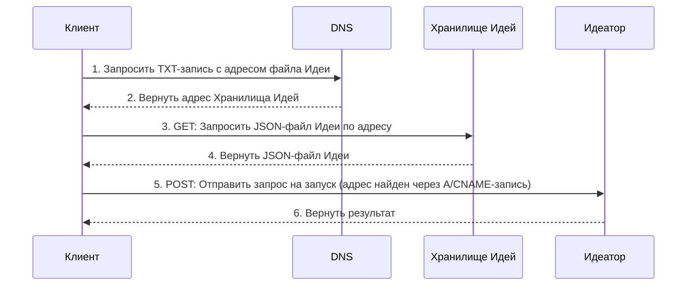

# 102: Концепция/Суверенитет

> [!DEFINITION] [Суверенитет](./000_glossary.md)
> Это правило, по которому личность и «прописка» :term[Идеи]{canonical="Idea"} в интернете полностью контролируются её владельцем. Для этого используется независимая система, обычно DNS, которая работает как всемирная адресная книга. Так владелец доказывает, что определённое пространство в сети, где его :term[Идеи]{canonical="Idea"} живут и развиваются, принадлежит именно ему.

> Sidenote:
> - Требуется:
>   - [101: Концепция/Идея](./101_concept_idea.md)
>   - [103: Концепция/Идеатор](./103_concept_ideator.md)

Правила :term[Суверенитета]{canonical="Sovereignty"} определяют, насколько независимыми могут быть создатели в этой системе. Они описывают многоуровневую структуру для размещения и запуска идей. Это позволяет каждому выбрать, сколько контроля он хочет иметь: от использования полностью готовых сервисов до самостоятельной настройки всего с нуля.

Эта модель — как мостик, который соединяет абстрактное понятие :term[Идеатора]{canonical="Ideator"} с реальным, работающим сервисом.

## Независимая личность через DNS

Вся система построена на одном главном принципе: **независимая личность через DNS**. Представь DNS как мировую адресную книгу интернета. Благодаря ей, :term[Идея]{canonical="Idea"} не привязана к какой-то одной компании или сайту. Это и делает возможным настоящий суверенитет.

Каждой :term[Идее]{canonical="Idea"} даётся уникальное имя-адрес (домен). В адресной книге интернета (DNS) делается специальная текстовая заметка (`TXT-запись`), которая указывает на главный файл-описание :term[Идеи]{canonical="Idea"}. Управляя этой заметкой, создатель полностью контролирует, как найти его :term[Идею]{canonical="Idea"} и где она «живёт».

### Единый поток запросов: Суверенитет пользователя через DNS

Эта схема показывает два главных действия с :term[Идеей]{canonical="Idea"}: получение её описания (`GET`) и её запуск как сервиса (`POST`). Она объясняет, как обычные записи в DNS дают пользователю полный контроль над тем, куда направлять запросы.

**Записи DNS пользователя — это его пульт управления.** `TXT-запись` домена указывает, где хранится файл с описанием :term[Идеи]{canonical="Idea"} (`Хранилище Идей`). А основная `A` или `CNAME` запись домена указывает, где находится сервис, который эту :term[Идею]{canonical="Idea"} запускает (:term[Идеатор]{canonical="Ideator"}). Управляя этими двумя записями, пользователь решает всё сам: использовать готовые сервисы или настроить всё на своём оборудовании.

> [!HEADSUP] На заметку
> Эту модель полезно представить как шкалу независимости. На одном её конце — готовый сервис, который всё делает за тебя, это удобно. На другом — **полный суверенитет**: ты используешь своё доменное имя и сам размещаешь все сервисы, по сути, становясь сам себе провайдером. А готовые уровни сервиса — это просто ступеньки, по которым можно постепенно двигаться от одного края к другому.



## Многоуровневая архитектура

На основе принципа независимой личности система предлагает пять необязательных, но последовательных уровней сервисов. Эти уровни позволяют создателям выбирать, сколько контроля им нужно: от удобных, полностью готовых решений до самостоятельного размещения всего необходимого для полного суверенитета.

### Уровень 1: Управляемое хранилище

Этот уровень даёт простое и быстрое решение для хранения самого файла с :term[Идеатором]{canonical="Ideator"}.

- **Как это работает:** Чтобы было проще начать, мы предлагаем хранить файл вашего :term[Идеатора]{canonical="Ideator"} в нашем облачном хранилище. `TXT-запись`, которую мы создадим для вашего адреса, будет указывать на этот файл. В любой момент вы можете переместить файл в другое место (например, на свой сервер или в децентрализованную сеть IPFS) и просто обновить `TXT-запись`.
- **Цель:** Избавить создателей от необходимости искать, где разместить файл, чтобы просто начать работать.

---

### Уровень 2: Автоматическое создание веб-страницы

Этот уровень превращает :term[Идеаторы]{canonical="Ideator"} в нечто понятное и полезное для людей — в веб-страницу, которая работает без необходимости запускать сервер.

- **Как это работает:** Для всех :term[Идеаторов]{canonical="Ideator"}, которые подключают эту услугу, используется одна и та же простая статическая веб-страница. Когда кто-то заходит на адрес :term[Идеатора]{canonical="Ideator"} в браузере, код на этой странице делает запрос в DNS, чтобы найти `TXT-запись` и узнать, где лежит файл-описание :term[Идеатора]{canonical="Ideator"} (с Уровня 1). Затем браузер загружает этот файл и на лету строит из него интерфейс — кнопки, текст и картинки.
- **Цель:** Дать каждому :term[Идеатору]{canonical="Ideator"} бесплатное и готовое к работе веб-приложение, чтобы начать было максимально просто.

---

### Уровень 3: Доступ для программ через CDN

Этот уровень улучшает взаимодействие между программами, когда им нужно прочитать описание :term[Идеи]{canonical="Idea"}.

- **Как это работает:** Мы используем сеть быстрой доставки контента (CDN), которая умеет умно перенаправлять запросы. Когда программа делает `GET`-запрос к адресу :term[Идеи]{canonical="Idea"}, CDN отдаёт ей специальный JavaScript-модуль. Это позволяет разработчикам легко импортировать отдельные части :term[Идеи]{canonical="Idea"} прямо в свой код. При этом сам файл-описание по-прежнему доступен, если запросить его с заголовком `Accept: application/json`.
- **Цель:** Предоставить программистам мощный и удобный способ работать с :term[Идеями]{canonical="Idea"} в коде.

```ts
// Также отдаётся заголовок X-Typescript-Types для сред вроде Deno
const { default: run, schema } = await import('http://my-idea.com');
console.log(`Схема идеи:`, schema);

// запустить идею как функцию напрямую
await run(input);
```

---

### Уровень 4: Публикация (`PUT`)

Этот уровень даёт возможность публиковать и обновлять :term[Идею]{canonical="Idea"} с помощью программ.

- **Как это работает:** Этот уровень обрабатывает `PUT`-запросы к адресу :term[Идеи]{canonical="Idea"}, которые требуют авторизации. Одним запросом можно загрузить новую версию файла :term[Идеи]{canonical="Idea"} и одновременно обновить все нужные записи, чтобы новая версия сразу стала активной.
- **Цель:** Предоставить создателям безопасный и простой способ управлять жизненным циклом своих :term[Идей]{canonical="Idea"} через код.

```ts
// опубликовать новую версию идеи
await fetch('http://my-idea.com', {
  method: 'PUT',
  data: JSON.stringify({ context, schema, solution }),
});
```

---

### Уровень 5: Полноценный запуск через API (`POST`)

Это самый высокий уровень функциональности, который превращает :term[Идеатор]{canonical="Ideator"} в настоящий веб-сервис, который можно вызывать.

- **Как это работает:** Этот уровень обрабатывает `POST`-запросы к адресу :term[Идеатора]{canonical="Ideator"}, запуская его логику. Это может быть реализовано через управляемый нами облачный сервис или пользователь может запустить его на своём собственном сервере.
- **Цель:** Дать всю мощь облачных вычислений, позволяя любому опубликовать полноценный микросервис, имея лишь один файл с его описанием.

```ts
// вызвать идею как сервис с новым контекстом
const idea = await fetch('http://my-idea.com', {
  method: 'POST',
  data: JSON.stringify(context),
});
console.log('Новое решение для идеи', idea.solution, 'соответствует схеме', idea.schema);
```

### Идея и Сервис: Заметка о запуске

Ключевой принцип этой архитектуры — разделение публичного описания (:term[Идеи]{canonical="Idea"}) и её выполнения. :term[Идея]{canonical="Idea"} — это самодостаточный чертёж. В нём есть всё: схема, контекст и :term[Решение]{canonical="Solution"}. Этого достаточно, чтобы любой умный агент мог её запустить. Это даёт пользователям свободу брать любую :term[Идею]{canonical="Idea"}, запускать её у себя на компьютере, экспериментировать, изменять и использовать так, как им хочется.

Поэтому «полноценный запуск» (Уровень 5) — это не требование, а мощное удобство и возможность для бизнеса. Он позволяет создателю предлагать свою :term[Идею]{canonical="Idea"} как надёжный, управляемый сервис. Именно здесь коммерция и коммерческие тайны могут процветать в открытой системе. Создатель может опубликовать :term[Идею]{canonical="Idea"} как прозрачный договор — описание того, что сервис делает и что возвращает, — но при этом держать в секрете детали своей реализации.

Эта секретная реализация — «фирменный рецепт» создателя. Он может включать в себя уникальные модели, специальное оборудование, редкие источники данных или хитрые алгоритмы. Сервис становится надёжным «чёрным ящиком», который выполняет публичное обещание :term[Идеи]{canonical="Idea"}. Так создаётся рынок, где открытые стандарты и ценные закрытые реализации могут существовать вместе и дополнять друг друга.

## От Суверенной Идеи к Суверенному Пространству

Хотя DNS даёт суверенитет над одной :term[Идеей]{canonical="Idea"}, его настоящая сила — в создании **Суверенного Пространства Имён**. Доменное имя вроде `my-project.com` указывает не просто на одну :term[Идею]{canonical="Idea"}, оно определяет целое цифровое «поместье», над которым у владельца полный контроль.

Это пространство можно структурировать с помощью путей, как на обычном веб-сайте.

- Сам домен (`my-project.com`) может вести к главной :term[Идее]{canonical="Idea"} (например, боту или описанию всего проекта).
- Пути внутри этого домена (`my-project.com/schemas/User`) могут вести к другим, вложенным :term[Идеям]{canonical="Idea"}.

Так создаётся чёткая иерархия: **домен** устанавливает суверенитет над всем пространством, а **путь** создаёт структуру внутри него. Это позволяет под одной «крышей» разместить и управлять целой коллекцией связанных :term[Идей]{canonical="Idea"}, от маленького компонента до целого приложения. Эта модель более подробно описана в концепции :term[Адресации]{href="./110_concept_addressing.md"}.

## Спецификация API

Все взаимодействия по HTTP происходят по главному адресу :term[Идеи]{canonical="Idea"} (`/`).

- **`GET /`**
  - С заголовком `Accept: text/html` (Уровень 2): Возвращает страницу для загрузки пользовательского интерфейса.
  - С заголовком `Accept: application/json` (Уровень 3): Возвращает исходный JSON-файл :term[Идеи]{canonical="Idea"}.
- **`PUT /`** (Уровень 4)
  - Требует авторизации. Один `PUT`-запрос одновременно загружает новый файл :term[Идеи]{canonical="Idea"} и обновляет `ТХТ-запись`, чтобы новая версия стала активной.
- **`POST /`** (Уровень 5)
  - Требует авторизации. Запускает :term[Идеатор]{canonical="Ideator"}.
  - Тело запроса — это JSON-объект с данными, например: `{"context": "Входные данные от пользователя для обработки"}`.

После того, как мы определили принцип :term[Суверенитета]{canonical="Sovereignty"}, который даёт владение и контроль над :term[Идеей]{canonical="Idea"} и её пространством, логично спросить: а что делает :term[Идею]{canonical="Idea"} исполняемой? Это приводит нас к концепции :term[Идеатора]{canonical="Ideator"}, особого типа :term[Идеи]{canonical="Idea"}, которая может действовать как функция.

```

```

```

```
