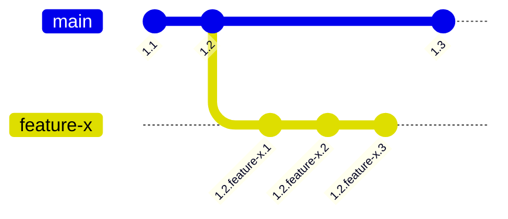

# 108: Концепция/Видимость

> [!DEFINITION] :term[Видимость]{canonical="Visibility"}
> Набор правил, которые определяют, какая версия :term[Идеи]{canonical="Idea"} будет показана в определённой ситуации. Видимость зависит от истории версий :term[Идеи]{canonical="Idea"}, её веток и того, как её запрашивают.

> Sidenote:
> - Требует:
>   - :term[107: Концепция/Идентичность]{href="./107_concept_identity.md"}
> - Открывает возможности для:
>   - :term[109: Концепция/Адресация]{href="./109_concept_addressing.md"}

Чтобы система развивающихся, связанных друг с другом :term[Идей]{canonical="Idea" href="./101_concept_idea.md"} была полезной, нужен ясный и предсказуемый способ определять, какая версия :term[Идеи]{canonical="Idea" href="./101_concept_idea.md"} видна в каждом конкретном случае. В этом документе мы рассмотрим модель, управляющую :term[видимостью]{canonical="Visibility"}. Она состоит из двух частей: системы версий, которая создаёт разные состояния :term[Идеи]{canonical="Idea" href="./101_concept_idea.md"}, и механизма выбора, который решает, какое из состояний показать.

## Управление версиями: Создание состояний для показа

Прежде чем выбрать версию, она должна существовать. :term[Иерархическое версионирование]{canonical="Hierarchical Versioning"} — это механизм, который создаёт и отслеживает разные состояния :term[Идеи]{canonical="Idea" href="./101_concept_idea.md"} со временем. Версия — это не просто число, а целая история развития :term[Идеи]{canonical="Idea" href="./101_concept_idea.md"}, записанная с помощью чисел и слов, разделённых точками.

Версии состоят из **числовых ревизий** для обычных, официальных выпусков (например, `1.2`) и **ревизий в ветках** для отдельных направлений разработки (например, `feature-x`). К примеру, версия `1.2.feature-x.3` говорит нам, что это третья доработка в ветке `feature-x`, которая отделилась от версии `1.2`.

::::columns
:::column
Версии состоят из **числовых ревизий** для обычных, официальных выпусков (например, `1.2`) и **ревизий в ветках** для отдельных направлений разработки (например, `feature-x`). К примеру, версия `1.2.feature-x.3` говорит нам, что это третья доработка в ветке `feature-x`, которая отделилась от версии `1.2`.

:::
:::column

:::
::::

Правила изменения версий:

- **Совместимые изменения**: Небольшие правки, после которых новая версия может полностью заменить старую. Например, изменение описания или добавление нового поля в схему. Такие изменения создают новую минорную ревизию (например, `1.2` становится `1.2.1`).
- **Несовместимые (ломающие) изменения**: Изменения, после которых новая версия не может заменить старую. Обычно это удаление или изменение существующих полей в схеме. Такие изменения требуют повышения основной версии (например, `1.2` станет `1.3`). Система может автоматически определять такие изменения в схеме.

## Выбор: Какое состояние показать

Когда у нас есть богатая история версий, нужен механизм, чтобы выбрать правильную. Это решается чётким разделением между тем, как :term[Идея]{canonical="Idea" href="./101_concept_idea.md"} публикуется и как её запрашивают. Процесс запроса имеет два измерения: **пространственное** (в каких разделах искать) и **временное** (на какой момент времени).

### Ветки: Публикация и разделение

> [!DEFINITION] :term[Ветка]{canonical="Branch"}
> Именованная метка, которая делит пространство видимости, создавая параллельную, отдельную среду для разработки и экспериментов. Привязка :term[Идеи]{canonical="Idea"} к ветке — это её публикация.

Например, каждая версия :term[Идеи]{canonical="Idea" href="./101_concept_idea.md"} в базе данных связана с одной или несколькими :term[ветками]{canonical="Branch"}, например, `["main", "feature/new-billing"]`. Такая публикация делает :term[Идею]{canonical="Idea" href="./101_concept_idea.md"} доступной в этих разделах, обеспечивая безопасную работу.

Это даёт два главных преимущества:

- **Изоляция**: Работа над новой функцией (например, в :term[ветке]{canonical="Branch"} `feature/new-billing`) не мешает стабильной :term[ветке]{canonical="Branch"} `main`. Это не даёт незаконченной или ошибочной работе сломать основную систему.
- **Эксперименты**: :term[Ветки]{canonical="Branch"} легко и быстро создавать. Это поощряет эксперименты: если что-то не получается, :term[ветку]{canonical="Branch"} можно просто удалить, и это никак не повлияет на основную систему.

### Путь Поиска: Приоритетный запрос

> [!DEFINITION] :term[Путь Поиска]{canonical="Search Path"}
> Упорядоченный список названий веток, который определяет, как происходит поиск. Он говорит системе, в каких разделах и в каком порядке искать, создавая систему «слоёв».

Этот механизм — основа рабочего процесса, отвечающая на вопрос «где искать?». Например, :term[путь поиска]{canonical="Search Path"} разработчика может быть таким: `['feature/my-new-idea', 'staging', 'main']`.

Такая настройка создаёт систему поиска по слоям:

1.  Сначала ищем :term[Идею]{canonical="Idea" href="./101_concept_idea.md"} в разделе `feature/my-new-idea`.
2.  Если не нашли, ищем в разделе `staging`.
3.  И только потом ищем в основном разделе `main`.

Это позволяет разработчику видеть мир, в котором его изменения плавно накладываются поверх стабильной системы.

### Момент времени: Временной запрос

> [!DEFINITION] :term[Момент Времени]{canonical="Cutoff Time"}
> Отметка времени, которая передаётся вместе с запросом. Она указывает системе найти версию :term[Идеи]{canonical="Idea"}, которая была последней на этот конкретный момент.

Второе измерение поиска — **временное**. Каждый запрос выполняется так, как будто мы смотрим на состояние системы в определённый момент времени. Это контролируется :term[Моментом Времени]{canonical="Cutoff Time"}.

Если :term[момент времени]{canonical="Cutoff Time"} не указан, система использует текущее время (`now()`), показывая самые свежие версии. Но если указать время в прошлом, можно совершить «путешествие во времени». Это заставит систему найти версию :term[Идеи]{canonical="Idea" href="./101_concept_idea.md"} — и всех связанных с ней идей — которая была последней согласно :term[пути поиска]{canonical="Search Path"} в тот самый момент. Эта возможность — основа для идеальной воспроизводимости результатов.

> Sidenote:
> - :term[107: Концепция/Идентичность]{href="./107_concept_identity.md"}

## От модели к применению

В этой главе мы описали теорию :term[видимости]{canonical="Visibility"} — как создавать разные состояния и как выбирать между ними. Теперь, когда модель готова, остался последний шаг — научиться с ней общаться на практике.

В следующем документе, :term[109: Концепция/Адресация]{href="./109_concept_addressing.md"}, мы познакомимся со схемой URI :term[idea:]{canonical="idea:"} — это конкретный язык, который используется для запроса нужного вида и путешествий по этому богатому миру версий и веток.
