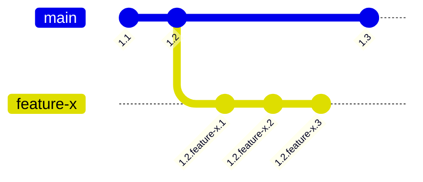

# 108: Концепция/Видимость

> [!DEFINITION] [Видимость](./000_glossary.md)
> Это набор правил, которые определяют, какая версия :term[Идеи]{canonical="Idea"} будет найдена в определённой ситуации. Видимость зависит от истории версий :term[Идеи]{canonical="Idea"}, её принадлежности к разным веткам разработки и настроек поиска того, кто её запрашивает.

> Sidenote:
> - Требует:
>   - :term[107: Концепция/Идентичность]{href="./107_concept_identity.md"}
> - Открывает возможности для:
>   - :term[015: Агент/Мета]{href="./015_agent_meta.md"}
>   - :term[110: Концепция/Адресация]{href="./110_concept_addressing.md"}

Чтобы система из постоянно меняющихся и связанных друг с другом :term[Идей]{canonical="Idea" href="./101_concept_idea.md"} была полезной, нужен понятный и предсказуемый способ определять, какую версию :term[Идеи]{canonical="Idea" href="./101_concept_idea.md"} мы видим — или какая **видима** — в каждом конкретном случае. Представьте, что :term[Идеи]{canonical="Idea"} — это книги в огромной библиотеке, которые постоянно переписывают. Модель :term[видимости]{canonical="Visibility"} состоит из двух частей: системы версий, которая создаёт разные издания книги, и механизма выбора, который решает, какое издание выдать читателю.

## Версионирование: Создание состояний для просмотра

Прежде чем выбрать версию, её нужно создать. :term[Иерархическое версионирование]{canonical="Hierarchical Versioning"} — это способ создавать и отслеживать разные состояния :term[Идеи]{canonical="Idea" href="./101_concept_idea.md"} во времени. Версия — это не просто число, а целая история развития :term[Идеи]{canonical="Idea" href="./101_concept_idea.md"}, записанная через точки.

Версии состоят из **целочисленных ревизий** для последовательных, основных выпусков (например, `1.2`) и **ревизий в ветках** для отдельных направлений разработки (например, `feature-x`). Например, версия `1.2.feature-x.3` говорит нам, что это третье изменение в ветке `feature-x`, которая отделилась от основной версии `1.2`.
::::columns
:::column
Версии состоят из **целочисленных ревизий** для последовательных, основных выпусков (например, `1.2`) и **ревизий в ветках** для отдельных направлений разработки (например, `feature-x`). Например, версия `1.2.feature-x.3` говорит нам, что это третье изменение в ветке `feature-x`, которая отделилась от основной версии `1.2`.
:::
:::column

:::
::::

Правила изменения версий:

- **Совместимые изменения**: Это когда новая версия может полностью заменить старую без каких-либо проблем. Например, если добавить новую информацию или исправить ошибку. Такие изменения создают новую небольшую ревизию (например, `1.2` становится `1.2.1`).
- **Несовместимые (ломающие) изменения**: Это когда новая версия настолько отличается, что не может заменить старую. Обычно это происходит при удалении или серьёзном изменении важных частей. Такие изменения требуют повышения основной версии (например, изменение, несовместимое с `1.2`, создаст версию `1.3`). Система может автоматически определять такие изменения.

## Выбор: Определение видимого состояния

Когда у нас есть богатая история версий, нужен механизм, который выберет правильную. Это решается чётким разделением между тем, как :term[Идея]{canonical="Idea" href="./101_concept_idea.md"} публикуется, и тем, как её находят. Процесс поиска имеет два измерения: **пространственное** (где искать) и **временное** (на какой момент времени).

### Ветки: Публикация и разделение

> [!DEFINITION] [Ветка](./000_glossary.md)
> Это специальная метка, которая создаёт отдельное, параллельное пространство для работы и экспериментов. Когда мы связываем :term[Идею]{canonical="Idea"} с веткой, мы как бы публикуем её в этом пространстве.

Например, каждая версия :term[Идеи]{canonical="Idea" href="./101_concept_idea.md"} в базе данных связана с одной или несколькими :term[ветками]{canonical="Branch"}, например `["main", "feature/new-billing"]`. Эта «публикация» делает :term[Идею]{canonical="Idea" href="./101_concept_idea.md"} доступной в этих пространствах, обеспечивая безопасную работу.

Это даёт два ключевых преимущества:

- **Изоляция**: Работа над новой функцией (например, в :term[ветке]{canonical="Branch"} `feature/new-billing`) не мешает стабильной основной :term[ветке]{canonical="Branch"} `main`. Это защищает основную систему от недоделанных или ошибочных изменений.
- **Эксперименты**: :term[Ветки]{canonical="Branch"} легко и быстро создавать. Это поощряет пробовать новое. Если эксперимент не удался, :term[ветку]{canonical="Branch"} можно просто удалить, и это никак не повлияет на основную систему.

### Путь поиска: Приоритетный поиск

> [!DEFINITION] [Путь поиска](./000_glossary.md)
> Это упорядоченный список названий веток, который говорит системе, где и в каком порядке искать :term[Идею]{canonical="Idea"}. Это создаёт систему «слоёв», где одни версии перекрывают другие.

Этот механизм поиска отвечает на **пространственный** вопрос «где искать?». Например, :term[путь поиска]{canonical="Search Path"} разработчика может быть таким: `['feature/my-new-idea', 'staging', 'main']`.

Такая настройка создаёт систему поиска по слоям:

1.  Сначала система ищет нужную :term[Идею]{canonical="Idea" href="./101_concept_idea.md"} в ветке `feature/my-new-idea`.
2.  Если не находит, ищет в ветке `staging`.
3.  И только потом ищет в основной ветке `main`.

Это позволяет разработчику видеть мир, в котором его собственные изменения органично наложены поверх стабильной системы.

### Момент времени: Временной поиск

> [!DEFINITION] [Момент времени](./000_glossary.md)
> Это отметка времени, которая передаётся вместе с запросом. Она указывает системе найти ту версию :term[Идеи]{canonical="Idea"}, которая считалась последней именно в этот момент.

Второе измерение поиска — **временное**. Каждый запрос выполняется так, как будто мы смотрим на состояние системы в определённый момент времени. Это контролируется :term[моментом времени]{canonical="Cutoff Time"}.

Если :term[момент времени]{canonical="Cutoff Time"} не указан, система использует текущее время (`now()`), находя самые свежие версии. Но если указать время в прошлом, можно совершить «путешествие во времени». Система найдёт ту версию :term[Идеи]{canonical="Idea" href="./101_concept_idea.md"} (и всех связанных с ней идей), которая была самой новой согласно :term[пути поиска]{canonical="Search Path"} в тот самый момент. Эта возможность — ключ к идеальной воспроизводимости результатов.

> Sidenote:
> - :term[107: Концепция/Идентичность]{href="./107_concept_identity.md"}

## От модели к применению

В этой главе мы описали теорию :term[видимости]{canonical="Visibility"} — как создавать разные состояния и выбирать между ними. Теперь, когда модель готова, нужен практический способ с ней работать.

Следующий документ, :term[110: Концепция/Адресация]{href="./110_concept_addressing.md"}, представит схему URI :term[idea:]{canonical="idea:"} — конкретный язык команд, который используется для запроса нужного вида и навигации по этой сложной, версионированной и разветвлённой реальности.
