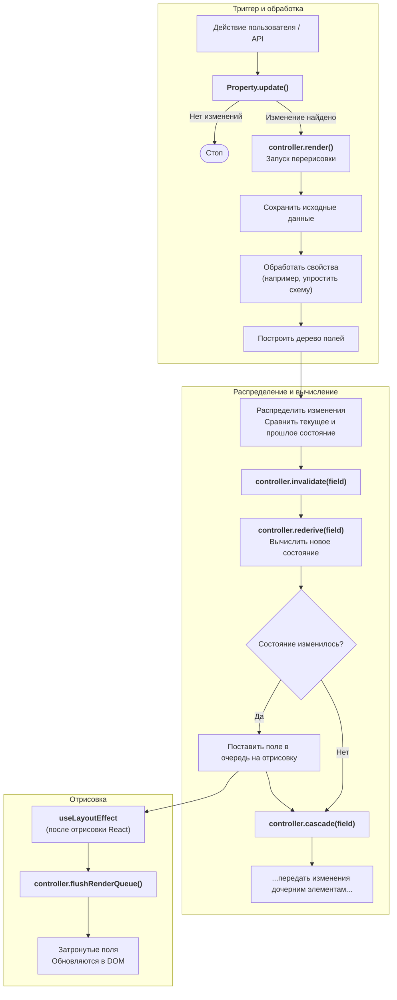

# 802: Пакет/Интерфейс

> [!DEFINITION] Архитектура в стиле дерева
> Это как умный конструктор для создания интерактивных веб-страниц. Он использует «схему» данных, как чертёж, чтобы автоматически строить интерфейс. Внешний вид можно менять с помощью специальных «таблиц стилей», а разные «адаптеры» позволяют показывать этот интерфейс где угодно.


> Sidenote:
> - Требуется:
>   - :term[800: Пакет/Схимия]{href="./800_package_schemistry.md"}

**Пакет «Интерфейс»** — это движок, для которого **структура и есть дизайн**. Вместо того чтобы вручную рисовать каждую кнопочку и каждое поле для разных данных, он создаёт интерфейс автоматически, просто глядя на их описание (JSON Schema). Это гарантирует, что интерфейс всегда точно соответствует данным: изменил описание — и страница тут же обновилась.

## Главная идея: Структура — единственный источник правды

В обычной разработке данные и интерфейс, который их показывает, часто «живут своей жизнью» и перестают соответствовать друг другу. Этот пакет решает проблему, делая :term[Схему]{canonical="Schema"} единственным и главным источником правды для интерфейса.

- **Создаётся на лету**: Интерфейс не прописан в коде заранее, а создаётся из :term[Схемы]{canonical="Schema"}. Если в :term[Схеме]{canonical="Schema"} что-то поменять (например, добавить новое поле), это тут же отразится на странице.
- **Всегда актуален**: Поскольку интерфейс — это прямое отражение данных, исчезает целый класс ошибок, когда страница показывает устаревшую информацию.

## Описание стилей и гибкая настройка

:term[Схема]{canonical="Schema"} говорит, *что* показывать, а **Таблица стилей** — *как* это будет выглядеть. Такое разделение позволяет полностью менять дизайн, не трогая саму структуру данных.

- **Слой с правилами**: Таблицы стилей — это как правила, которые связывают части :term[Схемы]{canonical="Schema"} с их внешним видом.
- **Легко менять**: Можно полностью изменить расположение элементов, отступы и цвета, просто подключив другую таблицу стилей. Это как надеть новую «скин» на программу.

## Адаптеры и совместимость

Движку неважно, где в итоге будет показан интерфейс. Он использует **Адаптеры**, чтобы превратить свою абстрактную идею интерфейса в конкретные элементы на экране.

- **Поддержка дизайн-систем**: Адаптеры могут работать с популярными наборами готовых компонентов (например, Material UI), превращая простые типы данных из :term[Схемы]{canonical="Schema"} в красивые и сложные элементы.
- **Запасной вариант — HTML**: Стандартный адаптер для HTML гарантирует, что любая :term[Схема]{canonical="Schema"} может быть показана как обычная веб-страница «из коробки».

## Разные режимы отображения

Одну и ту же :term[Схему]{canonical="Schema"} и данные можно показывать по-разному, используя **режимы отображения**.

- **Режим редактирования**: Создаёт формы, в которые можно вводить данные и проверять их правильность.
- **Режим просмотра**: Показывает те же данные в красивом и удобном для чтения виде, без возможности их изменить.

Это позволяет использовать одно описание данных для разных задач, уменьшая количество кода и делая создание и просмотр информации единообразными.

## Ключевые концепции

### Динамическая система свойств с вычислениями

Система построена вокруг контроллера, который может сам себя расширять. Разные модули-свойства сообщают ему о себе и о том, от чего они зависят. Это создаёт мощную и гибкую систему, где одни свойства вычисляются на основе других.

- **Свойства регистрируются сами**: Каждый модуль (например, для данных, :term[схемы]{canonical="schema"} или переменных) автоматически «знакомится» с системой, как только его подключают.
- **Объявление зависимостей**: Свойства могут сказать: «Я завишу от других свойств». Например, `стили` зависят от `переменных` и `настроек`.
- **Цепная реакция**: Когда основное свойство меняется, контроллер автоматически пересчитывает все зависимые от него свойства в правильном порядке. Так интерфейс всегда остаётся согласованным.
- **Безопасность типов**: TypeScript сам понимает, какие типы данных у контроллера и полей, анализируя все зарегистрированные свойства.
- **Модульная архитектура**: Можно добавлять новые свойства и логику их вычисления, не меняя существующий код.

### Пользовательские свойства

Эта динамическая система — ключ к расширяемости. Вы можете создавать и регистрировать свои собственные свойства, чтобы добавлять новые функции и управлять поведением полей. Это позволяет встраивать в движок мощную логику, заточенную под ваши задачи. Например, можно реализовать:

- Свойство `slots` (ячейки), которое на основе `стилей` решает, какие компоненты интерфейса показывать.
- Свойство `errors` (ошибки), которое на основе `данных` и `:term[схемы]{canonical="schema"}` проверяет правильность ввода.
- Особые свойства для стилей, которые меняются в зависимости от определённых условий в данных.

### Система компонентов с темами

Второй ключ к расширяемости — это система `Тем`. Она позволяет движку отрисовки быть полностью независимым от конкретной библиотеки интерфейсов. Система организует чёткий поток информации: от абстрактных данных до конкретного пикселя на экране.

1.  **:term[Схема]{canonical="Schema"} задаёт структуру**: Она определяет, из чего состоят данные, и общую иерархию интерфейса.
2.  **Контроллер создаёт состояние**: Он обрабатывает :term[схему]{canonical="schema"} и данные, создавая для каждого поля своё уникальное `состояние`.
3.  **Переменные (`vars`) объявляют «Атомы»**: С помощью CSS-переменных мы говорим, какие базовые компоненты-«атомы» использовать для разных частей поля (например, `--slot-title: 'TitleAtom'`).
4.  **«Атомы» — это кирпичики**: Это самые мелкие компоненты (например, поле ввода `<Input />` или кнопка `<Button />`), которые напрямую связаны с `состоянием` поля и отображают его.
5.  **Поля управляют отрисовкой**: Компонент `Field` (поле) — это дирижёр. Он проверяет, какие «атомы» ему назначены через переменные.
6.  **Отрисовка зависит от данных**: `Поле` покажет «атом», только если для него есть данные в `состоянии`. Это делает интерфейс минималистичным — ничего лишнего.
7.  **Поля как «листья» дерева**: Представляют одну единицу данных (например, строку) и собирают несколько «атомов» в законченный элемент (подпись, виджет, описание).
8.  **Поля как «ветки» дерева (Наборы полей)**: `Поле` может также быть «веткой» (объектом или массивом), которая организует расположение дочерних `Полей`.

Такое чёткое разделение ролей позволяет настраивать всё очень гибко: от логики обработки данных до финального внешнего вида.

### Управление состоянием и совместное использование структуры

Контроллер централизованно управляет состоянием всего дерева, различая исходные данные, обработанное состояние и последнее отрисованное состояние. Это позволяет эффективно отслеживать изменения.

- **Исходные данные (`controller.props`, `controller.data` и т.д.)**: Оригинальные параметры, переданные главному компоненту. Они являются источником правды и никогда не изменяются напрямую. Это позволяет работать в двух режимах.
  - **Контролируемый режим**: Когда данные приходят извне (`data` или `vars`), система использует их. Обновления вызывают специальные функции обратного вызова (`onChange`).
  - **Неконтролируемый режим**: Когда заданы только начальные данные (`initialData`), контроллер управляет состоянием самостоятельно.
- **Текущее состояние (`controller.current`)**: Обработанное состояние. После получения данных свойства обрабатываются (например, :term[схема]{canonical="schema"} упрощается, данные проверяются), и результат сохраняется в `controller.current`. Это состояние используется полями для отображения.
- **Предыдущее состояние (`controller.last`)**: Копия `текущего` состояния с прошлого цикла отрисовки. Она используется для сравнения с новым `текущим` состоянием, чтобы точно определить, что именно изменилось.

**Совместное использование структуры:**

Архитектура использует единое дерево состояний (`controller.current`), чтобы экономить память и поддерживать целостность данных.

- **Никаких дубликатов**: Поля не создают себе копии данных. Вместо этого они получают ссылки на «кусочки» общего дерева состояний `controller.current`.
- **Согласованность состояния**: Так как поля напрямую ссылаются на общее хранилище, данные всегда согласованы. Обновления интерфейса собираются вместе и применяются за один раз для лучшей производительности.
- **Видимость для потомков**: Родительские поля (например, для объекта) имеют доступ ко всему своему поддереву, включая все вложенные данные и :term[схемы]{canonical="schemas"}.

### Процесс обновления и вычислений

Контроллер использует единый процесс как для первой отрисовки, так и для всех последующих обновлений. Это делает поток данных предсказуемым. Вот как это работает шаг за шагом:

- **Триггер**: Происходит внешнее событие (например, пользователь что-то ввёл). Вызывается метод `update` соответствующего свойства, который проверяет, было ли изменение значимым. Если нет, процесс останавливается.

- **Перерисовка корня**: Если изменение обнаружено, запускается перерисовка корневого компонента `<Form>`. Это начинает основной цикл обработки в контроллере.

- **Сохранение исходных данных**: Во время отрисовки контроллер сначала сохраняет исходные данные из компонента `<Form>`.

- **Обработка свойств**: Исходные данные обрабатываются и превращаются в согласованное внутреннее состояние (`controller.current`). Например, :term[схема]{canonical="schema"} упрощается.

- **Построение дерева полей**: Контроллер находит все поля в обработанном состоянии и убеждается, что для каждого из них существует объект `field`.

- **Распределение изменений**: Контроллер сравнивает новое состояние `controller.current` с предыдущим (`controller.last`), чтобы определить, какие именно поля и свойства изменились.

- **Инвалидация и вычисление**: Для каждого обнаруженного изменения вызывается `controller.invalidate()`. Это запускает систему реактивных вычислений:
  - `controller.rederive()`: Вычисляет новые значения для всех зависимых свойств поля (например, `settings`, `styles`) в правильном порядке.
  - `controller.cascade()`: «Умно» передаёт изменения дочерним полям, запуская у них свои циклы пересчёта.
  - Любое поле, чьё состояние изменилось, ставится в очередь на перерисовку.

- **Пакетное обновление DOM**: После завершения цикла отрисовки React, специальный хук `useLayoutEffect` обрабатывает очередь. Все поля, которые были помечены для обновления, изменяются в DOM за один раз, что очень эффективно.

## Производительность и эффективность

### Эффективная отрисовка

Архитектура спроектирована для высокой производительности за счёт минимизации работы React и лишних перерисовок.

- **Точное обнаружение изменений**: Сравнивая `controller.current` и `controller.last` для исходных данных и проверяя глубокие изменения внутри цикла вычислений, система точно знает, какие поля изменились, и не делает лишней работы.
- **Выборочная инвалидация**: Обновляются только те поля, которые были затронуты изменением. Цепочка зависимостей гарантирует, что пересчитываются только нужные свойства.
- **Отложенная и пакетная отрисовка**: Запросы на перерисовку полей накапливаются в очереди. Контроллер обрабатывает эту очередь за один раз, минимизируя количество обращений к DOM.
- **Устранение дубликатов**: Если несколько изменений в одном цикле затрагивают одно и то же поле, оно всё равно будет перерисовано только один раз.

### Умное распространение изменений

Система эффективно передаёт изменения переменных вниз по дереву полей (похоже на наследование в CSS), минимизируя повторные вычисления.

- **Кэшированный граф зависимостей**: Отношения между всеми свойствами вычисляются один раз и сохраняются. Процесс `rederive` использует этот кэш, чтобы выполнять вычисления в правильном порядке, не пересчитывая его каждый раз.
- **Ленивое наследование**: Переменные «наследуются» от родительских элементов по запросу, когда поле вычисляет свои стили.
- **Выборочное распространение**: Когда CSS-переменная (`var`) меняется в поле, метод `cascade` передаёт это изменение его потомкам. Процесс останавливается, если потомок сам переопределяет эту переменную.
- **Дифференциальные обновления**: Чтобы избежать ненужных перерисовок, логика `rederive` глубоко сравнивает результат каждого вычисления. Поле помечается для обновления, только если изменение `var` действительно привело к другому конечному состоянию (например, другому объекту `style`).
- **Отрисовка по последствиям**: Это означает, что внешнее изменение вызовет перерисовку, только если оно привело к реальному изменению в интерфейсе. Если изменение было переопределено другим правилом и итоговый стиль не поменялся, лишней работы не будет.

## Пример потока обновления

Единый процесс обрабатывает все обновления. Цикл вычислений — это неотъемлемая часть фазы «Распределение».

```typescript
// Пользователь обновляет CSS-переменную на поле 'user.name'
await controller.update('user.name', 'vars', { '--field-color': 'red' });
```

Что происходит внутри:

- `controller.update()` вызывает метод `update` у свойства `VarsProperty`.
- Метод `update` обнаруживает изменение и вызывает `controller.render()`, запуская перерисовку корневого компонента.
- Контроллер выполняет свой цикл: **сохраняет** исходные данные, **обрабатывает** их в новое состояние `controller.current` и **строит** дерево полей.
- На этапе **распределения** контроллер видит, что `vars` у `user.name` изменились, и вызывает `controller.invalidate('user.name', 'vars')`.
- `controller.invalidate()` запускает логику вычислений:
  - Обновляет `field.vars` на поле 'user.name'.
  - Вызывает `controller.rederive(field, ['vars'])`.
  - Вызывает `controller.cascade(field, ['vars'])`.
- **Вычисление и распространение**: `rederive()` запускает цепочку зависимостей для поля 'user.name', обновляя его `стили` и ставя его в очередь на отрисовку. `cascade()` рекурсивно передаёт изменение дочерним элементам, запуская их процесс `rederive`.
- **`useLayoutEffect`** выполняется, обрабатывая очередь на отрисовку и обновляя DOM.

## Схема архитектуры: Жизненный цикл обновления



## Справочник API

### Методы контроллера

```typescript
// Обновить свойство поля
controller.update(path: string, property: string, value: any): Promise<boolean>

// Слить с существующим значением свойства
controller.merge(path: string, property: string, value: object): Promise<boolean>

// Получить значение свойства
controller.get(property: string, path?: string): any

// Унаследовать значение свойства от родительских элементов
controller.inherit(property: string, path: string, key?: string): any

// Подписаться на обновления поля
controller.register(path: string, forceRender: () => void): () => void
```

### Пример регистрации свойства

Свойства — это самодостаточные объекты, которые определяют, как управлять определённым аспектом состояния дерева.

```typescript
const StylesProperty = {
  priority: 50, // приоритет
  fieldDefaults: { styles: {} }, // значения по умолчанию

  // Объявляем, что это свойство зависит от 'vars' и 'settings'
  dependencies: ['vars', 'settings'],

  // --- Методы жизненного цикла ---

  // Вычисляет объект 'styles' на основе текущего состояния поля.
  // Запускается автоматически, когда меняются 'vars' или 'settings'.
  derive: field => {
    const newStyles = getComputedFieldStyles(
      field.mode,
      varName => field.controller.inherit('vars', field.path, varName),
      field.type
    );
    return { styles: newStyles };
  },

  // Обрабатывает обновления от поля, например controller.update('path', 'styles', ...)
  // Для вычисляемого свойства это используется редко.
  update: (field, controller, value) => {
    // Обычно вычисляемые свойства нельзя обновлять вручную.
    return false; 
  },

  // Вызывается методом controller.update() для запуска процесса вычислений.
  invalidate: (field, controller, newValue, oldValue) => {
    // Для вычисляемых свойств invalidate проще. Основная логика в `derive`.
    // Логика rederive в контроллере сама займётся пересчётом.
    // Для базового свойства вроде 'vars' это бы запустило всю цепочку.
    controller.rederive(field, ['styles']);
    controller.cascade(field, ['styles']);
  },
};

Property.register('styles', StylesProperty);
```

Эта архитектура создаёт надёжную основу для отрисовки сложных интерфейсов, сохраняя при этом отличную производительность и удобство для разработчика.
