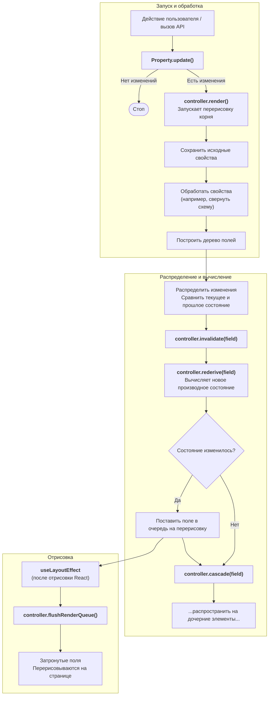

# 802: Пакет/Интерфейс

> [!DEFINITION] [Древовидная архитектура](./000_glossary.md)
> Это очень быстрая и гибкая система для создания пользовательских интерфейсов. Она работает быстро, потому что у неё есть особый «мозг» (контроллер), который проверяет каждую деталь отдельно и умным способом понимает, какие части интерфейса зависят друг от друга.


> Sidenote:
> - Требуется:
>   - :term[800: Пакет/Схимия]{href="./800_package_schemistry.md"}

Пакет «Интерфейс» использует **Древовидную архитектуру**. Это такой движок, который превращает простые схемы и формы в универсальный **«Авто-конструктор» интерфейсов**.

## Идея: больше, чем просто формы

Изначально мы вдохновлялись инструментами для создания форм, но пошли гораздо дальше. Наша система — это как 3D-принтер для интерфейсов. Ты загружаешь в него **Схему** (чертёж) и **Данные** (материал для печати), а он автоматически создаёт готовый интерфейс.

Этот «Авто-конструктор» может показывать одну и ту же модель в разных режимах:

- **Режим редактирования**: интерактивная форма, где можно вводить и менять данные.
- **Режим просмотра**: красивая версия только для чтения, как экспонат в музее.

Благодаря этому один-единственный чертёж — Схема — управляет и тем, как данные вводятся, и тем, как они показываются.

## Как это устроено внутри

### Умная система свойств и зависимостей

В основе системы лежит контроллер, который похож на умного шеф-повара на кухне. Вместо того чтобы знать все рецепты заранее, он позволяет разным **Свойствам** (ингредиентам) самим представляться и сообщать, что им нужно.

- **Саморегистрация**: Свойства (например, `данные`, `схема`, `переменные`) — это отдельные модули, которые сами записываются в «поваренную книгу» контроллера.
- **Объявление зависимостей**: Свойства говорят, что им нужно от других. Например, свойство `стили` заявляет: «Мне нужны `переменные` и `настройки`, чтобы я мог работать».
- **Цепочки зависимостей**: Когда ты меняешь основной ингредиент, шеф-повар тут же понимает, какие зависимые части рецепта нужно переделать, и делает это в правильном порядке. Всё всегда остаётся согласованным.
- **Надёжность**: Тип контроллера автоматически определяется на основе всех зарегистрированных свойств, что предотвращает ошибки.

### Свойства, созданные пользователем

Эту систему можно расширять до бесконечности. Разработчики могут добавлять свои собственные свойства, чтобы научить «шеф-повара» новым трюкам. Например:

- **Слоты**: решать, какие детали интерфейса показывать, основываясь на `стилях`.
- **Ошибки**: проверять правильность данных на основе `данных` и `схемы`.
- **Особая логика**: менять поведение интерфейса в ответ на определённые условия в данных.

### Система компонентов с темами

Движок не привязан к какой-то одной библиотеке интерфейсов (например, React или Vue). Он использует систему **Тем**, чтобы превратить абстрактные данные в то, что ты видишь на экране.

Это происходит так:

1.  **Схема**: Определяет структуру и порядок элементов.
2.  **Контроллер**: «Шеф-повар», который обрабатывает схему и данные, подготавливая `состояние` для каждого элемента.
3.  **Переменные**: Правила, похожие на CSS, которые говорят, какие компоненты-`Атомы` в какие `слоты` нужно поместить.
4.  **Атомы**: Самые маленькие кирпичики интерфейса (например, поле ввода `<Input />`), которые отображают состояние элемента.
5.  **Поля**: «Прорабы», которые собирают `Атомы` вместе по правилам из `переменных`.

Такое разделение позволяет настраивать всё что угодно: от обработки данных до финального внешнего вида.

## Управление состоянием

Контроллер — это мозг, который хранит состояние всего дерева интерфейса. Он использует умную технику **«совместного использования структур»**, чтобы экономить память и работать очень быстро.

- **Исходные свойства**: Оригинальный «рецепт» (`данные`, `переменные`), который никогда не меняется.
- **Текущее состояние (`controller.current`)**: Это «рабочая доска» шеф-повара, где отражено всё, что происходит прямо сейчас. Все элементы интерфейса смотрят на неё.
- **Прошлое состояние (`controller.last`)**: Фотография «рабочей доски» секунду назад. Контроллер сравнивает её с текущей, чтобы увидеть, что именно изменилось.

Элементы интерфейса не хранят свои копии данных — они просто смотрят на общий «чертёж» в `controller.current`. Это гарантирует, что весь интерфейс всегда работает как единое целое.

## Процесс обновления и вычислений

Контроллер использует единый процесс для всех обновлений, что делает его работу предсказуемой.

1.  **Запуск**: Событие (ввод текста, нажатие кнопки) запускает метод `update` у свойства.
2.  **Обработка**: Исходные данные обрабатываются и превращаются в согласованное внутреннее состояние (`controller.current`).
3.  **Распределение**: Контроллер сравнивает `текущее` и `прошлое` состояния, чтобы найти только те элементы, что изменились.
4.  **Пересчёт**:
    - **`rederive()`**: Пересчитывает зависимые свойства (например, `стили`) для затронутых элементов.
    - **`cascade()`**: Распространяет изменения (например, переменные стилей) на все дочерние элементы.
5.  **Отрисовка**: Все обновления собираются вместе и применяются за один раз с помощью `useLayoutEffect`.

### Схема: жизненный цикл обновления



## Производительность

Такая архитектура почти не нагружает React, потому что:

- **Точное обнаружение изменений**: Система проверяет, действительно ли что-то поменялось, и обновляет только нужные элементы.
- **Выборочный пересчёт**: Благодаря графу зависимостей пересчитываются только те свойства, которые правда зависят от изменения.
- **Пакетная отрисовка**: Множество мелких изменений собираются в одно большое обновление.
- **Умное наследование**: Стили и переменные кешируются, и перерисовка запускается, только если конечный результат (например, объект `style`) действительно изменился. Это убирает лишнюю работу.

## Справка по API

### Методы контроллера

```typescript
// Обновить свойство поля
controller.update(path: string, property: string, value: any): Promise<boolean>

// Объединить с существующим значением свойства
controller.merge(path: string, property: string, value: object): Promise<boolean>

// Получить значение свойства
controller.get(property: string, path?: string): any

// Наследовать значение свойства вверх по дереву
controller.inherit(property: string, path: string, key?: string): any

// Зарегистрировать подписчика на поле
controller.register(path: string, forceRender: () => void): () => void
```

### Пример регистрации свойства

```typescript
const StylesProperty = {
  priority: 50,
  fieldDefaults: { styles: {} },
  dependencies: ['vars', 'settings'],

  derive: field => {
    const newStyles = getComputedFieldStyles(
      field.mode,
      varName => field.controller.inherit('vars', field.path, varName),
      field.type
    );
    return { styles: newStyles };
  },

  invalidate: (field, controller, newValue, oldValue) => {
    controller.rederive(field, ['styles']);
    controller.cascade(field, ['styles']);
  },
};

Property.register('styles', StylesProperty);
```
