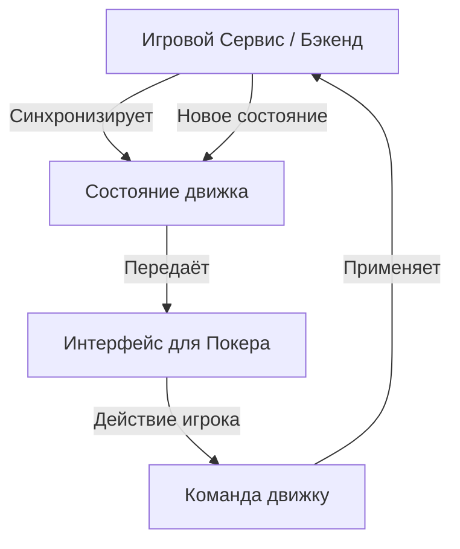

# 851: Пакет/Интерфейс для Покера

> [!DEFINITION] Интерфейс для Покера
> Это библиотека, которая отвечает только за внешний вид игры в покер. Она работает по простому принципу: ей показывают, как выглядит игра в данный момент (кто какие карты держит, сколько фишек на столе), и она это рисует. Когда игрок что-то делает (например, ставит фишку), интерфейс не решает, правильно это или нет, а просто сообщает об этом действии основной программе. В самом интерфейсе нет никаких правил игры.

> Sidenote:
> - Требует:
>   - :term[851: Пакет/Движок для Покера]{href="./851_package_poker_engine.md"}
> - Совместим с:
>   - :term[850: Пакет/Игровой Сервис]{href="./850_package_game_service.md"}

Пакет **Интерфейс для Покера** — это хороший пример того, как нужно создавать «лицо» игры в современном мире, где вся логика находится на общем сервере. Он даёт готовый стол для покера, который можно настроить по своему вкусу, при этом все «мозги» игры — правила, подсчёт очков — передаются специальному :term[Движку для Покера]{href="./851_package_poker_engine.md"}.

## Принцип работы

Главная идея этого проекта — строго разделить внешний вид и «мозги» игры:

1.  **Только картинка**: В интерфейсе **нет никакой логики игры**. Он не считает, кто победил, не следит за правилами и не определяет, чей сейчас ход. Он просто рисует то, что ему присылает движок — текущее :term[состояние]{canonical="State"} игры.
2.  **Управляемый ввод**: Интерфейс похож на марионетку. Главный компонент `<PokerGame />` получает «команду», как ему выглядеть (`state`), а когда игрок что-то делает, он просто сообщает об этом через `onStateChange`. Он не принимает решений сам.
3.  **Подключаемый движок**: Интерфейс полностью доверяет :term[Движку для Покера]{href="./851_package_poker_engine.md"}. Это гарантирует, что правила игры будут одинаковыми и для игрока, и для сервера.
4.  **Готов к работе в сети**: Его можно легко подключить к :term[Игровому Сервису]{href="./850_package_game_service.md"}, чтобы играть с другими людьми по сети.

## Как это устроено

Вся система работает по принципу одностороннего движения данных. Главный источник правды — это сервер, который решает, что происходит в игре.



Такое разделение даёт несколько крутых возможностей:

- **Быстрый отклик**: Действия игрока можно показать на экране мгновенно, не дожидаясь ответа от сервера. Это делает игру плавной.
- **Повтор игры**: Можно «скормить» интерфейсу всю историю состояний игры, и он в точности покажет, как проходила партия.
- **Лёгкое тестирование**: Интерфейс можно проверить, просто показывая ему заранее подготовленные состояния игры. Не нужно запускать всю сложную игровую логику.

## Как использовать

Главная часть — это компонент `<PokerGame />`. Ему нужно всего две вещи: объект с текущим :term[состоянием]{canonical="State"} игры и «слушатель», который будет реагировать на действия игрока.

```tsx
import React, { useState } from 'react';
import * as Poker from '@idealic/poker-engine';
import { PokerUI } from '@idealic/poker-ui';
import '@idealic/poker-ui/src/style.scss';

const App = () => {
  // 1. Задаём начальное состояние (обычно приходит с сервера)
  const [state, setState] = useState<Poker.State>(initialState);

  const handleStateChange = (newState: Poker.State) => {
    // 2. Сразу обновляем состояние у себя, чтобы не ждать
    setState(newState);

    // 3. Отправляем действие на сервер (чтобы он проверил)
    // api.sendAction(newState.lastAction);
  };

  return (
    <PokerUI
      state={state}
      onStateChange={handleStateChange}
      author="Player1" // От чьего лица мы смотрим на игру (чтобы видеть свои карты)
      options={{
        buyIn: 1000,
      }}
    />
  );
};
```

### Подключение к Игровому Сервису

При подключении к :term[Игровому Сервису]{href="./850_package_game_service.md"}, обработка действий передаётся на сервер:

```tsx
// ... внутри вашего компонента
const handleStateChange = async (newState: Poker.State) => {
  // Сервис обрабатывает состояние (проверяет правила, переходит к следующему раунду)
  const processed = await Service.process(newState);
  setState(processed);
};
```

## Настройка

Интерфейс легко расширять. Можно заменить отдельные его части (например, карты или фишки) своими собственными, не ломая общую структуру.

```tsx
import { PokerUI, Card } from '@idealic/poker-ui';

// Наш собственный компонент для карт
const MyCustomCard = props => <div className="my-fancy-card">{props.card}</div>;

<PokerUI
  state={state}
  components={{
    Card: MyCustomCard, // Заменяем стандартный компонент Card
    // Так же можно заменить фишки, игрока, стол и т.д.
  }}
/>;
```

## Стили

Стандартные стили находятся в файле `src/style.scss`. Они используют специальную систему именования, чтобы было легко менять внешний вид с помощью обычного CSS.
