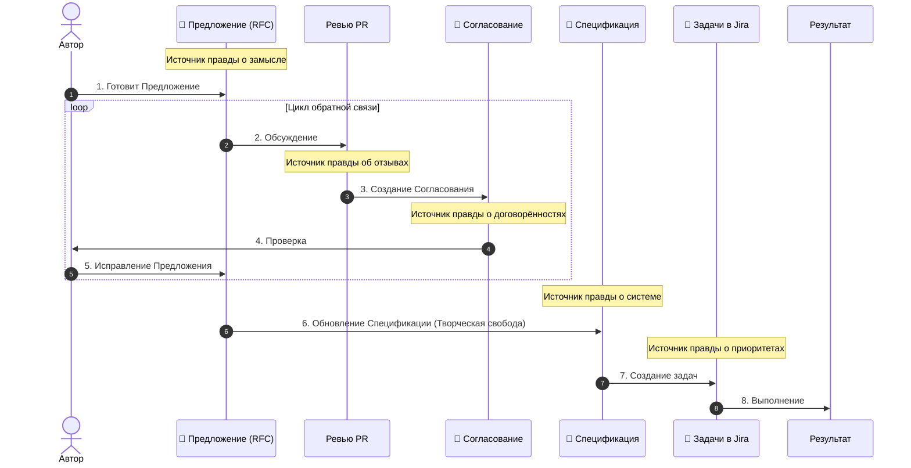

# 02: Компания/Процесс

> [!DEFINITION] Стандартный Процесс
> Это наши правила работы, которые помогают превратить абстрактную идею в работающий продукт. Мы делаем это вместе, шаг за шагом улучшая наши задумки и часто общаясь, чтобы все были в курсе дела.

> Sidenote:
>
> - Связано с документом: :term[00: Компания/Истина]{href="./50_prompt_truth.md"}

Мы на распутье. Чтобы перейти от простых исследований к настоящим открытиям и достижениям, нам нужен чёткий и строгий план действий, которого мы все будем придерживаться.

## 1. Наше видение

Мы верим в одну простую вещь: **Если составить правильную и подробную Спецификацию, то сама работа превращается в пустяк.**

Сейчас мы вручную превращаем документы в код или презентации, но одновременно создаём инструменты, которые будут делать это автоматически. :term[Спецификация]{canonical="Specification"} — это наш единственный и главный источник правды. **Когда есть такая ясная инструкция, работа становится простой, и не нужно никого постоянно контролировать.**

Как только :term[Предложение]{canonical="Proposal"} одобрено, начинается этап **Творческой Свободы**. Инженер может решать задачу так, как считает нужным. Единственные рамки — это :term[Спецификация]{canonical="Specification"} и конкретные задачи, созданные на основе :term[Предложения]{canonical="Proposal"}.

**Важно: мы никогда не меняем :term[Спецификацию]{canonical="Specification"} напрямую.** Процесс создания :term[Предложения]{canonical="Proposal"} — это не формальность, а обязательный шаг для любого изменения в нашем источнике правды.

> [!DANGER] НЕ НАЧИНАТЬ РАБОТУ БЕЗ ОДОБРЕНИЯ
> Не начинай ничего делать (писать код, рисовать дизайн), пока твоё :term[Предложение]{canonical="Proposal"} не одобрено.
>
> - **Ошибайся на бумаге:** Переписать текст :term[Предложения]{canonical="Proposal"} — это быстро и дёшево. А вот переписывать код или переделывать 20 слайдов — долго и дорого.
> - **Сначала — главное:** Сперва реши, что и зачем ты хочешь сделать, а уже потом разбирайся с мелкими деталями.

## 2. Наши документы

Мы делим нашу работу на три вида документов, чтобы в ней были ясность, порядок и согласие.

### :term[20: Спецификация]{href="./20_document_spec.md"} (Источник правды)

Конечная цель. Это подробное и постоянно обновляемое описание нашей системы. Единственный источник правды.

- **Соответствие правде:** Она строго следует правилам, описанным в документе :term[00: Компания/Истина]{href="./50_prompt_truth.md"}. Она должна быть понятной сама по себе, без двусмысленностей.
- **Правильность важнее скорости:** В отличие от временных документов, :term[Спецификация]{canonical="Specification"} должна быть абсолютно точной. Лучше оставить что-то неописанным, чем описать неверно.
- **Карта:** Она показывает, _куда мы идём_. С ней любой член команды может понять общую картину, не держа весь план в голове.
- **Борьба со сложностью:** Для больших систем невозможно запомнить все детали. :term[Спецификация]{canonical="Specification"} позволяет системе расти, сохраняя единый и понятный источник правды.
- **Всегда актуальна:** Это абсолютный **Источник Правды для Системы** (кода, презентаций, архитектуры).

### :term[21: Предложение]{href="./21_document_proposal.md"} (Идея на пробу)

Временный документ с идеей. Здесь мы в безопасности описываем, что _хотим_ сделать. Это позволяет нам обсуждать изменения, не ломая то, что уже работает.

- **Источник задач:** Из этого документа рождаются конкретные задачи для инженеров. Это **Источник Правды о Замысле** (и, следовательно, для Jira).
- **Разделение ответственности:** Он отделяет «Что мы хотим» от «Как мы это сделаем». Это позволяет нам спорить о ценности идеи, не увязая в технических деталях.
- **Безопасные эксперименты:** Позволяет предлагать смелые изменения, не нарушая источник правды. Если :term[Предложение]{canonical="Proposal"} отклонят, мы потеряем лишь текстовый файл.
- **Контекст для машины:** Искусственному интеллекту (ИИ) нужна точная информация. Этот документ служит для него «инструкцией».

### :term[22: Согласование]{href="./22_document_alignment.md"} (Договорённость)

Автоматически созданная выжимка из нашего обсуждения. Она гарантирует, что каждое мнение было услышано, а каждое решение — записано, прежде чем мы начнём работу.

- **Мудрость вкратце:** Превращает запутанную переписку в чёткий список технических требований. Отсеивает шум, оставляя только суть.
- **Живое согласие:** Это не просто история переписки, а рабочее пространство, где автор и проверяющий договариваются о _новом_ плане, родившемся в ходе обсуждения.
- **Инструкция для машины:** Служит проверенной инструкцией для ИИ, который будет выполнять изменения.
- **Проверка на месте:** Помогает автору убедиться, что машина (а значит, и вся команда) полностью поняла все отзывы, прежде чем двигаться дальше.
- **Одноразовый:** Этот документ нужен лишь один раз и служит **Источником Правды об Обсуждении**. Он **никогда не сохраняется** в основной проект.

## 3. Цикл согласования

Мы не просто «пишем код» или «делаем слайды». Мы следуем циклу, в котором замысел важнее исполнения. Нельзя сразу перепрыгивать к финалу.

1.  **Написать :term[Предложение]{canonical="Proposal"}:** Автор создаёт :term[Документ-предложение]{href="./21_document_proposal.md"}, где описывает проблему и как её можно решить.
2.  **Обсудить:** Команда обсуждает :term[Предложение]{canonical="Proposal"} через Pull Request. Здесь задают вопросы, спорят и оставляют комментарии.
3.  **Создать :term[Согласование]{canonical="Alignment"}:** Мы используем ИИ, чтобы он на основе обсуждения создал :term[Документ-согласование]{href="./22_document_alignment.md"}. Он превращает «комментарии» в «требования».
4.  **Проверить:** Автор проверяет :term[Документ-согласование]{canonical="Alignment"}. Если он неточный, **не нужно его редактировать**. Надо добавить уточняющие комментарии в Pull Request и создать документ заново, пока он не станет идеальным.
5.  **Исправить :term[Предложение]{canonical="Proposal"}:** Автор вносит изменения из :term[документа Согласования]{href="./22_document_alignment.md"} в своё :term[Предложение]{href="./21_document_proposal.md"}. Так в нём остаётся не первоначальная задумка, а **финальная, согласованная идея**. После этого :term[Предложение]{canonical="Proposal"} «замораживается».
6.  **Обновить :term[Спецификацию]{canonical="Specification"}:** Опираясь на замороженное :term[Предложение]{canonical="Proposal"}, мы обновляем :term[Спецификацию]{href="./20\*document*spec.md"} *перед\_ тем, как писать код. Это творческий шаг, где «Что» превращается в «Как».
7.  **Создать задачи:** Мы создаём **задачи в Jira** на основе **целей** из :term[Предложения]{href="./21_document_proposal.md"} и обновлённой :term[Спецификации]{href="./20_document_spec.md"}.
8.  **Выполнить:** Мы создаём конечный продукт (код, презентацию и т.д.).

> [!NOTE] Не бюрократия, а ясность
> Этот процесс нужен не для того, чтобы усложнить жизнь, а чтобы сохранить порядок.
>
> | Документ         | Источник правды для... | Роль                                  |
> | :--------------- | :--------------------- | :------------------------------------ |
> | **Предложение**  | **Замысла**            | Сохраняет видение автора.             |
> | **Ревью PR**     | **Обратной связи**     | Даёт сырые идеи и критику.            |
> | **Согласование** | **Договорённости**     | Обобщает достигнутое согласие.        |
> | **Jira**         | **Приоритетов**        | Отслеживает порядок выполнения работ. |
> | **Спецификация** | **Системы**            | Описывает реальное положение дел.     |
>
> Решая проблемы с общением и пониманием _до_ начала работы, мы даём инженеру свободу творить с уверенностью.

> [!NOTE] Творческая свобода и планы реализации
> На этапе **выполнения** инженер (или ИИ) может составить для себя **План реализации** (пошаговую техническую инструкцию). Это его личный черновик, помогающий перейти от :term[Предложения]{canonical="Proposal"} к коду. Его **не нужно** никому показывать и согласовывать. Главное, чтобы результат соответствовал утверждённому :term[Предложению]{canonical="Proposal"}, а «как» именно это сделано — решает сам исполнитель.

> [!WARNING] Что делать, если план изменился (Микро-цикл)
> Если во время работы ты понимаешь, что в плане есть ошибка или от него нужно отойти (например: «Мне нужно ещё 5 слайдов», «Эта архитектура не сработает»), ты **ОБЯЗАН** вернуться назад.
>
> - **PR ещё открыт:** Обнови существующее :term[Предложение]{canonical="Proposal"} и попроси проверить его ещё раз. (Можно заново создать :term[Документ-согласование]{canonical="Alignment Document"}, чтобы учесть только новые комментарии).
> - **PR закрыт / Работа началась:** Если работа уже идёт, **не открывай старое :term[Предложение]{canonical="Proposal"}**. Создай новое микро-предложение для твоего конкретного изменения.
>
> **Не отклоняйся от общего решения втихую.** Несогласованные изменения портят наш Источник Правды.

## 4. Ритуал синхронизации

> [!DEFINITION] Звонки 1-на-1
> Это частые короткие созвоны, чтобы убирать преграды в работе, отвечать на вопросы и поддерживать доверие друг к другу.

Мы каждый день созваниваемся, чтобы не было ситуаций, когда кто-то долго работает в одиночку и делает что-то не то.

- **Ежедневные 10-минутные созвоны:** Короткая, быстрая встреча с руководителем, чтобы убедиться, что мы всё ещё движемся в правильном направлении.
- **Подготовка обязательна:** К звонку нужно приходить с готовыми темами для обсуждения.
- **Процесс даёт спокойствие:** Этот ритуал убирает тревогу и неизвестность.

## 5. Роль машины

Мы используем искусственный интеллект не чтобы он думал за нас, а чтобы он помогал нам придерживаться наших же правил. Машина — это рычаг, а :term[Документ-согласование]{canonical="Alignment Document"} — точка опоры.

- **Надиктовать, чтобы определить:** Мы часто надиктовываем наши мысли голосом, чтобы точно передать замысел.
- **Входные данные для работы:** :term[Документ-согласование]{canonical="Alignment Document"} — это главная инструкция для ИИ.
- **Проверка результата:** Мы оцениваем работу ИИ, сравнивая её с тем, что написано в наших документах.

## Итог

Мы отказываемся от иллюзии свободы в пользу реального прогресса. Устанавливая строгие правила для принятия решений, мы освобождаем себя для достижения невероятных результатов.
