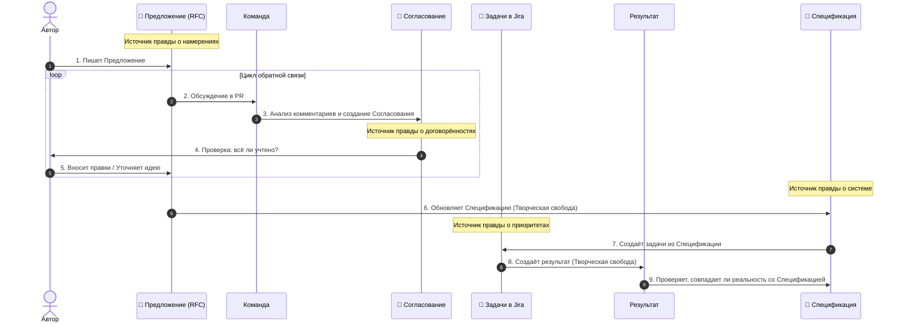

# 02: Компания/Процесс

> [!DEFINITION] Стандартный процесс
> Это наши правила работы. Они помогают превращать большие мечты в настоящие, работающие вещи. Для этого мы все вместе отвечаем за результат, шаг за шагом улучшаем наши идеи и постоянно общаемся, чтобы не сбиться с пути.

> Sidenote:
> - Связано с документом: :term[00: Компания/Источник правды]{href="./50_prompt_truth.md"}

Мы сейчас на развилке. Чтобы не просто изучать мир, а по-настоящему создавать что-то новое и двигаться вперёд, нам нужны чёткие и понятные правила.

## 1. Наше видение

Наш главный принцип такой: **Если у тебя есть очень точный и понятный план (мы называем его Спецификацией), то сделать по нему что-либо — уже пустяк.**

Сейчас мы вручную превращаем документы в код или презентации, но в то же время мы создаём инструменты, которые будут делать это автоматически. **:term[Спецификация]{canonical="Specification"}** — это как главный чертёж, где записана вся правда о проекте. **Когда такой чертёж есть, сама работа становится простой, и не нужно стоять у каждого над душой и всё контролировать.**

Как только :term[Предложение]{canonical="Proposal"} одобрят, начинается время **Творческой Свободы**. Инженер может решать задачу как хочет, главное — не выходить за рамки **:term[Спецификации]{canonical="Specification"}** и задач, которые из этого :term[Предложения]{canonical="Proposal"} появились.

**Очень важно: мы никогда не меняем :term[Спецификацию]{canonical="Specification"} просто так.** Процесс с :term[Предложением]{canonical="Proposal"} — не прихоть, а обязательный шаг, чтобы можно было внести изменения в наш главный «чертёж».

> [!DANGER] НЕ НАЧИНАЙ РАБОТУ БЕЗ ОДОБРЕНИЯ
> Не начинай ничего делать (писать код, рисовать дизайн), пока **:term[Предложение]{canonical="Proposal"}** не одобрено.
>
> - **Ошибайся на бумаге:** Переписать текст :term[Предложения]{canonical="Proposal"} — дёшево. Переписывать готовый код или переделывать 20 слайдов — дорого.
> - **Сначала — главное:** Сначала реши, *что* и *зачем* ты хочешь сделать, а потом уже разбирайся с мелкими деталями.

## 2. Наши рабочие документы

Мы делим нашу работу на три вида документов, чтобы всё было ясно, безопасно и все думали об одном и том же.

### :term[20: Спецификация]{href="./20_document_spec.md"} (Источник правды)

The permanent destination. Это главный и самый точный документ, который описывает, как устроена наша система. Он как конституция для нашего проекта.

- **Верность правде:** Он строго следует правилам, описанным в документе :term[00: Компания/Источник правды]{href="./50_prompt_truth.md"}. Он должен быть понятен сам по себе, без лишних объяснений.
- **Точность важнее скорости:** В отличие от временных документов, :term[Спецификация]{canonical="Specification"} должна быть абсолютно точной. Лучше оставить что-то неописанным, чем описать неверно.
- **Карта:** Она показывает, _куда мы идём_. Она помогает каждому в команде видеть общую картину, не держа весь план в голове.
- **Борьба со сложностью:** Для больших систем невозможно удержать в голове все детали. :term[Спецификация]{canonical="Specification"} позволяет системе расти, сохраняя единый и понятный источник правды.
- **Всегда актуальна:** Это абсолютный **Источник Правды для Системы** (кода, презентаций, архитектуры).

### :term[21: Предложение]{href="./21_document_proposal.md"} (Идея на пробу)

Это временный документ (вроде черновика), где мы безопасно описываем, что _хотим_ сделать. Он позволяет нам пробовать новые идеи, не ломая то, что уже работает.

- **Источник задач:** Из этого документа рождаются конкретные задачи для инженеров. Это **Источник Правды о Намерениях** (а потом и для Jira).
- **Разделение труда:** Он разделяет вопросы «Что мы хотим?» и «Как мы это сделаем?». Это позволяет обсуждать ценность идеи, не увязая в технических мелочах.
- **Безопасные эксперименты:** Можно предлагать смелые изменения, не боясь сломать главный «чертёж». Если :term[Предложение]{canonical="Proposal"} отклонят, мы потеряем только текстовый файл.
- **Инструкция для машины:** Искусственному интеллекту нужны чёткие инструкции. Этот документ — и есть такая инструкция.

### :term[22: Согласование]{href="./22_document_alignment.md"} (Договор)

Это краткий итог нашего обсуждения, который создаётся автоматически. Он помогает убедиться, что каждое мнение было услышано, а каждое решение — записано, прежде чем мы начнём работу.

- **Мудрость вкратце:** Он превращает длинную переписку в чёткий список требований. Убирает лишний шум и оставляет только суть.
- **Живое согласие:** Это не просто история переписки. Это место, где автор и проверяющий вместе создают _новый_ план, рождённый в споре.
- **Команда для ИИ:** Этот документ становится проверенной инструкцией, по которой искусственный интеллект выполняет изменения.
- **Проверка на месте:** Автор может проверить по этому документу, что машина (а значит, и команда) всё поняла правильно, прежде чем двигаться дальше.
- **Одноразовый:** Этот документ нужен только один раз. Это **Источник Правды об Обсуждении**. Мы **никогда не сохраняем его** в наш проект.

## 3. Цикл согласования

Мы не просто «пишем код». Мы следуем определённому циклу:

1.  **Написать :term[Предложение]{canonical="Proposal"}:** Автор создаёт :term[документ-предложение]{href="./21_document_proposal.md"}, где описывает проблему и как её можно решить.
2.  **Обсудить:** Команда обсуждает :term[Предложение]{canonical="Proposal"} через Pull Request. Здесь задают вопросы, спорят и делятся идеями.
3.  **Собрать :term[Согласование]{canonical="Alignment"}:** Мы используем ИИ, чтобы создать :term[документ-согласование]{href="./22_document_alignment.md"} из обсуждения. Он превращает «комментарии» в «требования».
4.  **Проверить и переделать:** Автор проверяет :term[Согласование]{canonical="Alignment"}. Если оно неточное, его **нельзя править вручную**. Нужно добавить уточняющие комментарии и создать документ заново, пока он не станет идеальным.
5.  **Обновить :term[Спецификацию]{canonical="Specification"}:** Когда все договорились, мы обновляем :term[Спецификацию]{href="./20*document_spec.md"}, чтобы отразить в ней новый план, *ещё до* написания кода. Это творческий шаг, где «что» мы хотим сделать, превращается в «как».
6.  **Создать задачи:** Мы создаём **задачи в Jira** на основе обновлённой :term[Спецификации]{canonical="Specification"}.
7.  **Сделать продукт:** Мы создаём конечный результат (код, презентацию и т.д.).

> [!NOTE] Не бюрократия, а ясность
> Эти правила существуют не для того, чтобы мешать, а чтобы всё сохранить.
>
> - **:term[Предложение]{canonical="Proposal"}** сохраняет замысел (Источник Правды о Намерениях).
> - **:term[Согласование]{canonical="Alignment"}** сохраняет договорённости (Источник Правды об Обсуждении).
> - **Jira** отслеживает порядок дел (Источник Правды о Приоритетах).
> - **:term[Спецификация]{canonical="Specification"}** описывает реальность (Источник Правды о Системе).
>
> Налаживая общение *до* начала работы, мы даём инженеру свободу творить с уверенностью.

> [!NOTE] Творческая свобода и планы работы
> На этапе работы инженер или ИИ может создать внутренний **План Реализации** (пошаговую инструкцию). Это личный документ, чтобы перейти от идеи к коду. Его не нужно показывать команде. Главное, чтобы результат соответствовал :term[Предложению]{canonical="Proposal"}, а «как» именно это сделано — решает сам автор.

> [!WARNING] Если что-то пошло не так
> Если во время работы ты понимаешь, что в плане есть ошибка или нужно от него отступить, ты **ОБЯЗАН** вернуться назад. Обнови :term[Предложение]{canonical="Proposal"} или создай новое. Нельзя молча делать по-своему.

## 4. Ритуал синхронизации

> [!DEFINITION] Звонки один на один
> Короткие и частые созвоны, чтобы помочь друг другу, ответить на вопросы и сохранить доверие.

Мы каждый день сверяем часы, чтобы не получилось так, что каждый работает в своем мире.

- **Ежедневные 10-минутные встречи:** Короткий разговор с руководителем, чтобы убедиться, что мы всё ещё движемся в нужную сторону.
- **Готовиться обязательно:** К звонку нужно приходить с готовыми темами для разговора.
- **Спокойствие благодаря правилам:** Этот ритуал убирает тревогу и неуверенность.

## 5. Роль машины

Мы используем искусственный интеллект не для того, чтобы он думал за нас, а чтобы он помогал нам следовать нашим же правилам. Машина — это рычаг, а :term[документ-согласование]{canonical="Alignment Document"} — точка опоры.

- **Диктуй, чтобы объяснить:** Мы часто надиктовываем свои мысли, чтобы лучше передать идею.
- **Входные данные для работы:** :term[Документ-согласование]{canonical="Alignment Document"} служит главной инструкцией для ИИ.
- **Проверка результата:** Мы оцениваем работу ИИ, сравнивая её с тем, что написано в наших документах.

## Итог

Мы меняем иллюзию полной свободы на возможность реально двигаться вперёд. Ограничивая *то, как* мы принимаем решения, мы расширяем границы *того, чего* мы можем достичь.
