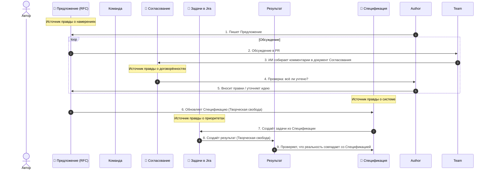

# 02: Компания/Процесс

> [!DEFINITION] Наш рабочий процесс
> Это наши правила, которые помогают превращать большие идеи в реальные вещи. Мы работаем вместе, постоянно улучшаем то, что делаем, и часто общаемся, чтобы убедиться, что всё делаем правильно.

> Sidenote:
> - Связано с документом: :term[00: Компания/Источник Правды]{href="./50_prompt_truth.md"}

Мы сейчас на развилке. Мы много исследовали, а теперь пора по-настоящему создавать, открывать и двигаться вперёд. Для этого нам нужен чёткий и понятный план действий, которому мы будем следовать.

## 1. Наше видение

В основе нашей работы лежит одна простая мысль: **Если у тебя есть очень подробный и понятный план, то сама работа становится лёгкой.**

Сейчас мы превращаем наши документы в код и презентации вручную, но параллельно создаём инструменты, которые будут делать это автоматически. :term[Спецификация]{canonical="Specification"} — это наш единственный источник правды. **Когда есть такой чёткий план, работа становится простой, и никому не нужно следить за каждым твоим шагом.**

Как только :term[Предложение]{canonical="Proposal"} одобрят, начинается время **Творческой Свободы**. Инженер может решать задачу так, как ему нравится. Единственное правило — держаться в рамках :term[Спецификации]{canonical="Specification"} и задач, которые из этого :term[Предложения]{canonical="Proposal"} получились.

**Важно: мы никогда не меняем :term[Спецификацию]{canonical="Specification"} напрямую.** Нельзя просто взять и что-то в ней исправить. Сначала нужно обязательно пройти через процесс :term[Предложения]{canonical="Proposal"}. Только так можно вносить изменения в наш главный план.

> [!DANGER] НЕ РАБОТАЙ БЕЗ ОДОБРЕНИЯ
> Не начинай ничего делать (писать код, рисовать в Figma), пока :term[Предложение]{canonical="Proposal"} не будет одобрено.
>
> - **Ошибайся на бумаге, а не в деле:** Переписать текст в :term[Предложении]{canonical="Proposal"} — это легко. А вот переделывать готовый код или презентацию на 20 слайдов — долго и дорого.
> - **Сначала общее, потом детали:** Сначала нужно договориться о главной идее и направлении, а уже потом решать мелкие задачки.

## 2. Наши рабочие документы

Мы делим нашу работу на три типа документов. Это помогает нам сохранять ясность, избегать ошибок и быть на одной волне.

### :term[20: Спецификация]{href="./20_document_spec.md"} (Источник правды)

Это наш главный, постоянно обновляемый документ. В нём записано, как на самом деле устроена наша система. Это единственный источник правды.

- **Только правда:** Этот документ написан по строгим правилам, которые мы определили в :term[00: Компания/Источник Правды]{href="./50_prompt_truth.md"}. Всё в нём должно быть понятно и однозначно.
- **Правильность важнее скорости:** В отличие от временных заметок, :term[Спецификация]{canonical="Specification"} должна быть абсолютно точной. Лучше оставить что-то недописанным, чем написать неправду.
- **Карта:** Она показывает, _куда мы движемся_. Любой член команды может посмотреть в неё и понять общую картину, не держа весь план в голове.
- **Борьба со сложностью:** Когда система очень большая, невозможно запомнить все детали. :term[Спецификация]{canonical="Specification"} помогает нам развивать систему, сохраняя порядок и не теряя общую картину.
- **Всегда актуальная:** Это **главный источник правды для всей Системы** (для кода, презентаций, архитектуры).

### :term[21: Предложение]{href="./21_document_proposal.md"} (Идея на обсуждение)

Это временный документ-черновик. Здесь мы безопасно обсуждаем то, что _хотим_ сделать. Это позволяет нам пробовать разные идеи, не ломая наш главный план.

- **Источник задач:** Из этого документа рождаются конкретные задачи для инженеров. Это **источник правды о наших намерениях** (а потом и для Jira).
- **Разделение ответственности:** Он отделяет вопрос «Что мы хотим сделать?» от вопроса «Как мы будем это делать?». Так мы можем обсудить ценность идеи, не увязнув в технических деталях.
- **Безопасные эксперименты:** :term[Предложение]{canonical="Proposal"} позволяет нам предлагать смелые изменения, не боясь что-то сломать. Если идею отклонят, мы просто удалим текстовый файл, и всё.
- **Инструкция для машины:** Искусственному интеллекту, который нам помогает, нужны чёткие указания. Этот документ — как раз такая инструкция.

### :term[22: Согласование]{href="./22_document_alignment.md"} (Договорённость)

Это автоматически созданная краткая выжимка из нашего обсуждения. Она нужна, чтобы убедиться, что мы учли мнение каждого и всё записали, прежде чем начать работу.

- **Мудрость команды в одном файле:** Этот документ превращает длинную переписку в чёткий список требований. Он убирает весь шум и оставляет только самое важное.
- **Живой консенсус:** Это не просто история переписки. Это место, где автор и проверяющий вместе приходят к _новому_ плану, который родился в ходе обсуждения.
- **Инструкция для ИИ:** Он служит проверенной инструкцией для нашего ИИ-помощника, чтобы тот мог выполнить все изменения.
- **Проверка на месте:** Автор может использовать этот документ, чтобы убедиться, что машина (а значит, и вся команда) правильно поняла все замечания, прежде чем двигаться дальше.
- **Одноразовый:** Этот документ нужен только один раз, как **источник правды о результатах обсуждения**. Мы **никогда не сохраняем** его в нашем общем хранилище.

## 3. Цикл согласования

Мы не просто «пишем код». Мы следуем определённому циклу:

1.  **Написать :term[Предложение]{canonical="Proposal"}:** Автор создаёт :term[документ-Предложение]{href="./21_document_proposal.md"}, где описывает проблему и как её можно решить.
2.  **Обсудить:** Команда обсуждает :term[Предложение]{canonical="Proposal"}. Все вопросы, споры и идеи обсуждаются здесь.
3.  **Собрать :term[Согласование]{canonical="Alignment"}:** Мы используем ИИ, чтобы собрать все комментарии в один :term[документ-Согласование]{href="./22_document_alignment.md"}. Он превращает «комментарии» в «требования».
4.  **Проверить и пересобрать:** Автор читает документ :term[Согласования]{canonical="Alignment"}. Если там что-то не так, **его нельзя редактировать вручную**. Нужно добавить уточняющие комментарии и попросить ИИ пересобрать документ, пока он не станет точным.
5.  **Исправить :term[Предложение]{canonical="Proposal"}:** Автор вносит все договорённости из :term[Согласования]{href="./22_document_alignment.md"} обратно в :term[Предложение]{href="./21_document_proposal.md"}. Теперь в нём записана не первоначальная идея, а **конечная, согласованная со всеми версия**. После этого :term[Предложение]{canonical="Proposal"} «замораживается».
6.  **Обновить :term[Спецификацию]{canonical="Specification"}:** Опираясь на замороженное :term[Предложение]{canonical="Proposal"}, мы обновляем :term[Спецификацию]{href="./20*document_spec.md"}, чтобы отразить в ней новый план, *прежде чем* писать код. Здесь «Что мы хотим» превращается в «Как это будет устроено».
7.  **Создать задачи:** Мы создаём **задачи в Jira**, основываясь на **намерениях** из :term[Предложения]{href="./21_document_proposal.md"} и новом состоянии :term[Спецификации]{href="./20_document_spec.md"}.
8.  **Сделать работу:** Мы создаём конечный результат (код, презентацию и т.д.).

> [!NOTE] Это не бюрократия, а ясность
> Этот процесс придуман не для того, чтобы усложнить жизнь, а чтобы всё сохранить.
>
> - **:term[Предложение]{canonical="Proposal"}** сохраняет нашу идею (Источник правды о намерениях).
> - **:term[Согласование]{canonical="Alignment"}** сохраняет договорённости (Источник правды об обсуждении).
> - **Jira** отслеживает порядок работы (Источник правды о приоритетах).
> - **:term[Спецификация]{canonical="Specification"}** описывает реальность (Источник правды о системе).
>
> Договариваясь обо всём *до* начала работы, мы даём инженеру свободу творить с уверенностью.

> [!NOTE] Творческая свобода и планы реализации
> На этапе работы инженер (или ИИ) может составить для себя внутренний **План реализации** (пошаговую инструкцию). Это его личный черновик, который помогает перейти от идеи к коду. Его **не нужно** показывать команде. Главное, чтобы результат соответствовал согласованному :term[Предложению]{canonical="Proposal"}, а «как» именно это сделано — решает сам автор.

> [!WARNING] Что делать, если план изменился?
> Если во время работы ты понимаешь, что план не работает или нужно от него отойти (например, «нужно ещё 5 слайдов» или «эта архитектура не сработает»), ты **ОБЯЗАН** вернуться к обсуждению.
>
> - **Если :term[Предложение]{canonical="Proposal"} ещё обсуждается:** обнови его и попроси команду посмотреть ещё раз.
> - **Если :term[Предложение]{canonical="Proposal"} уже закрыто:** **не открывай его заново**. Создай новое, маленькое :term[Предложение]{canonical="Proposal"} для твоего конкретного изменения.
>
> **Не отклоняйся от плана втихую.** Любые несогласованные изменения портят наш Источник правды.

## 4. Ритуал синхронизации

> [!DEFINITION] Звонки 1-на-1
> Это частые короткие разговоры, которые помогают решать проблемы, отвечать на вопросы и сохранять доверие в команде.

Мы каждый день сверяемся друг с другом, чтобы не сбиться с пути, работая в одиночку.

- **Ежедневные 10-минутные звонки:** Короткая встреча с руководителем, чтобы убедиться, что мы всё ещё движемся в правильном направлении.
- **Готовиться обязательно:** К звонку нужно приходить с готовыми темами для обсуждения.
- **Спокойствие благодаря процессу:** Этот ритуал убирает тревогу и неуверенность.

## 5. Роль машины

Мы используем искусственный интеллект не для того, чтобы он думал за нас, а чтобы помогал нам следовать нашим же правилам. Машина — это рычаг, а документ :term[Согласования]{canonical="Alignment"} — точка опоры.

- **Диктовка для ясности:** Мы часто надиктовываем наши мысли, чтобы лучше передать идею.
- **Инструкция для работы:** Документ :term[Согласования]{canonical="Alignment"} — это главная инструкция для ИИ.
- **Проверка результата:** Мы оцениваем работу ИИ, сравнивая её с тем, что написано в наших документах.

## Итог

Мы меняем иллюзию полной свободы на реальный прогресс. Устанавливая строгие правила для принятия решений, мы освобождаем себя для достижения невероятных целей.
