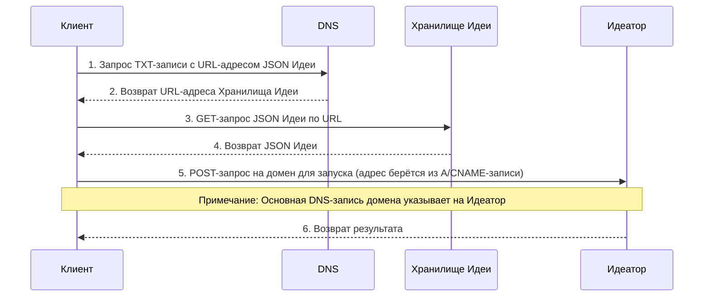

# 102: Концепция/Суверенитет

> Sidenote:
> 
> - Требуется:
>   - [101: Концепция/Идея](./101_concept_idea.md)
>   - [103: Концепция/Идеатор](./103_concept_ideator.md)

## 1. Введение

Этот документ описывает правила **Суверенитета**. «Суверенитет» — это слово, которое означает, сколько свободы и контроля ты получаешь над своими творениями. Представь, что ты строишь что-то в интернете. Ты можешь выбрать: использовать готовые инструменты, которые мы предоставляем (это проще), или построить всё самому с нуля (это сложнее, но даёт полный контроль).

Мы разложили все эти возможности по полочкам, как этажи в здании. Эта инструкция — мостик, который помогает превратить твою абстрактную идею (`Ideator`) в настоящий, работающий сервис.

## 2. Многоуровневая архитектура

Вся наша система устроена как пятиэтажное здание (Уровни 1-5). Фундаментом для всего служит твоя **Децентрализованная Личность**, о которой мы говорили в документе [101: Концепция/Идея](./101_concept_idea.md). Эта модель позволяет тебе выбрать, на каком «этаже» тебе удобнее всего работать — от простого цифрового имени до полноценного веб-сервиса, который мы поможем тебе запустить.

> Проще всего представить это как шкалу свободы. С одной стороны — готовый сервис, где мы обо всём заботимся за тебя. Это удобно. С другой стороны — **полный суверенитет**: ты используешь своё собственное интернет-имя (домен) и сам размещаешь все свои творения у себя. Ты становишься сам себе хозяином. Наши готовые уровни — это просто ступеньки, которые помогают перейти от одного состояния к другому, если захочешь.

#### Единый поток запросов: Суверенитет пользователя через DNS

На схеме ниже показаны два основных способа взаимодействия с Идеей: получение её описания (`GET`) и её запуск как сервиса (`POST`). Она показывает, как обычные записи DNS дают тебе полный контроль над тем, куда направлять запросы.

**Твои записи в DNS — это твой пульт управления.** Запись `TXT` твоего домена указывает на местоположение файла с описанием `Идеи` в формате JSON (`Хранилище Идеи`). Основная запись домена, `A` или `CNAME`, указывает на место, где Идея запускается (`Идеатор`). Управляя этими двумя записями, ты решаешь всё: будешь ли ты использовать наши готовые сервисы или свою собственную инфраструктуру.

### Уровень 1: Готовое хранилище (хостинг)

Это самый простой способ начать. Мы предлагаем тебе бесплатное и простое место для хранения файла с описанием твоего Идеатора.

- **Как это работает:** Представь, что мы даём тебе полку в нашей цифровой библиотеке (это называется S3-хранилище), чтобы ты мог положить туда свою «инструкцию». Запись `TXT` в твоей «адресной книге» будет указывать на эту полку. Но в любой момент ты можешь забрать свою инструкцию и положить её куда угодно (например, на свой сервер или в IPFS) и просто поменять адрес в `TXT`-записи.
- **Зачем это нужно:** Чтобы тебе не пришлось искать место для хранения файла, когда ты только начинаешь.

---

### Уровень 2: Создание интерфейса на лету

Этот уровень превращает твой Идеатор в то, что люди могут увидеть и использовать — в обычную веб-страницу. И для этого не нужны мощные серверы.

- **Как это работает:** Представь, что у нас есть универсальная веб-страница, как пустой холст. Когда кто-то заходит на адрес твоего Идеатора, на этой странице запускается маленькая программка (JavaScript). Она безопасно заглядывает в «адресную книгу» интернета (через DNS-over-HTTPS), находит твою `TXT`-запись, берёт оттуда ссылку на твою «инструкцию» (с Уровня 1), скачивает её и прямо на месте строит из неё красивый интерфейс — с кнопками и текстом.
- **Зачем это нужно:** Чтобы бесплатно и мгновенно дать каждому Идеатору своё «лицо» — готовое веб-приложение, которое легко запустить.

---

### Уровень 3: Умный доступ для программ (`GET`)

А это уровень для программистов и других программ, чтобы им было удобно общаться с твоей Идеей.

- **Как это работает:** Мы используем умных помощников по всему миру (это называется CDN). Когда другая программа делает `GET`-запрос к твоей Идее, этот помощник не просто отдаёт весь файл целиком. Он может выдать только нужную часть, например, одну конкретную функцию (это как «именованный экспорт»). Он даже может приложить «оглавление» (заголовок `X-TypeScript-Types`), чтобы программа-собеседник точно знала, как с твоей Идеей работать. А если кому-то всё же нужен весь файл-инструкция, он может попросить его, используя специальный заголовок `Accept: application/json`.
- **Зачем это нужно:** Чтобы дать другим программам удобный и современный способ работать с твоей Идеей, с подсказками и автодополнением кода.

---

### Уровень 4: Публикация (`PUT`)

Этот уровень позволяет тебе публиковать и обновлять свою Идею с помощью программ.

- **Как это работает:** Этот уровень принимает специальные, защищённые `PUT`-запросы. Представь, что ты хочешь обновить свою «инструкцию». Ты отправляешь один-единственный запрос, который одновременно загружает новый файл и тут же обновляет адрес в `TXT`-записи, чтобы все сразу начали использовать новую версию. Всё происходит мгновенно и безопасно.
- **Зачем это нужно:** Чтобы дать тебе простой и надёжный способ управлять жизненным циклом твоих Идей.

---

### Уровень 5: Полный запуск по API (`POST`)

Это самый крутой уровень. Он превращает твой Идеатор из простого описания в настоящий, работающий веб-сервис.

- **Как это работает:** Этот уровень обрабатывает `POST`-запросы к твоему Идеатору, то есть выполняет его логику. Это как нажать на кнопку «Пуск». Запустить эту логику можем мы, в нашей «мастерской» (это называется бессерверная функция), или ты можешь указать адрес своей собственной мастерской.
- **Зачем это нужно:** Чтобы дать твоей Идее всю мощь настоящей программы, которую можно вызывать из любой точки мира. Ты можешь опубликовать полноценный микросервис, имея на руках лишь один файл с его описанием.

## 3. Спецификация API

Это краткая шпаргалка для программистов, объясняющая, как взаимодействовать с твоей Идеей. Все запросы отправляются на основной адрес Идеи (`/`).

- **`GET /`**
  - С заголовком `Accept: text/html` (Уровень 2): Возвращает статическую страницу-загрузчик или перенаправляет на URL-адрес из поля `page`.
  - С заголовком `Accept: application/json` (Уровень 3): Возвращает исходный JSON-файл Идеи.
- **`PUT /`** (Уровень 4)
  - Требует аутентификации. Один `PUT`-запрос одновременно загружает новый исходный файл Идеи и атомарно обновляет URL-адрес `code` в `TXT`-записи, чтобы новая версия стала активной.
- **`POST /`** (Уровень 5)
  - Требует аутентификации/авторизации. Запускает Идеатор.
  - Тело запроса — это JSON-объект с данными, например: `{"context": "Входные данные от пользователя для обработки"}`.